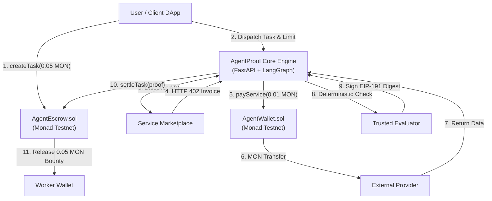
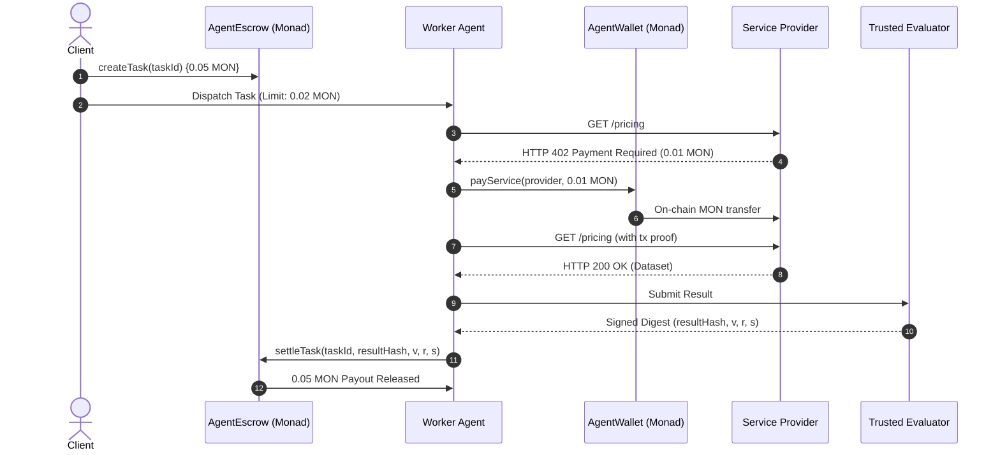

<div align="center">

# ⚡ AgentProof
### The On-Chain Economic & Settlement Layer for Autonomous AI Agents

[-8A2BE2?style=for-the-badge&logo=ethereum&logoColor=white)](https://testnet.monadscan.com)
[](https://soliditylang.org/)
[](https://fastapi.tiangolo.com)
[](https://github.com/langchain-ai/langgraph)
[](https://nextjs.org/)
[-brightgreen?style=for-the-badge&logo=pytest&logoColor=white)](./run_tests.py)
[](https://monad.xyz)

<br/>

> **"Spend by policy. Work autonomously. Get paid by proof."**

<br/>

**[🌐 Live Deployment](https://agentproof.vercel.app)** • **[💻 GitHub Repository](https://github.com/Aaryan-Sharma-5/AgentProof)** • **[🔍 MonadScan Explorer](https://testnet.monadscan.com)**

</div>

---

## 1. 📌 Executive Summary

**AgentProof** is a decentralized, on-chain economic operating and settlement protocol built for autonomous AI agents on **Monad**. 

Today, AI agents lack native economic autonomy. Giving an agent an unconstrained private key risks catastrophic treasury drain, while requiring manual human approval destroys autonomy. AgentProof solves both sides of the loop through two decoupled financial primitives:
1. **AgentFlow (`AgentWallet.sol`)**: Restricts what an agent can **spend** via deterministic spending policies and immutable per-transaction caps.
2. **ProofBounty (`AgentEscrow.sol`)**: Governs when an agent gets **paid** by releasing escrowed funds only upon cryptographic verification of completed work.

```text
       ┌────────────────────────────────────────────────────────┐
       │                       USER / CLIENT                     │
       │       Dispatches Task + Locks Reward + Sets Budget     │
       └───────────────────────────┬────────────────────────────┘
                                   │
                                   ▼
       ┌────────────────────────────────────────────────────────┐
       │                     AUTONOMOUS AGENT                   │
       │                                                        │
       │   [SPENDING PRIMITIVE]              [EARNING PRIMITIVE]│
       │       AgentFlow                         ProofBounty    │
       │           │                                  │         │
       │    AgentWallet.sol                    AgentEscrow.sol  │
       │   "Can I spend this?"               "Did I earn this?" │
       │           │                                  │         │
       │   HTTP 402 Paywall                  Verified Settlement│
       │    Buys API Data                      Collects Reward  │
       └───────────────────────────┬────────────────────────────┘
                                   │
                                   ▼
       ┌────────────────────────────────────────────────────────┐
       │            COMPLETED & CRYPTOGRAPHICALLY PROVEN        │
       │          Sub-Second Finality on Monad Testnet          │
       └────────────────────────────────────────────────────────┘
```

---

## 2. 🌍 The Real-World Problem

1. **The Autonomous Spending Paradox**: If an AI agent holds an unconstrained private key, hallucinations, prompt injections, or logic loops can drain the entire wallet. If a human must approve every micro-transaction, autonomous execution is broken.
2. **The Missing Machine Payment Rail (HTTP 402)**: Agents need to acquire real-time external data (APIs, market feeds, compute). Traditional fiat rails require credit cards, human KYC, and high fees, keeping the `HTTP 402 Payment Required` standard unusable.
3. **The Earning Counterparty Dilemma**: Upfront payments expose clients to incomplete or hallucinated deliverables. Post-work payments expose worker agents to non-paying clients. Subjective human arbitration cannot scale to machine-speed workflows.

---

## 3. 💡 The Solution

AgentProof establishes an end-to-end, two-sided economic framework:

- **Controlled Expenditure (`AgentWallet.sol`)**: An immutable, non-custodial smart contract wallet with an immutable per-transaction ceiling (`0.02 MON`). Even if an LLM is compromised, it is mathematically incapable of spending above policy.
- **Conditional Bounty Settlement (`AgentEscrow.sol`)**: Client bounties are locked in escrow upfront and programmatically released to the worker via deterministic cryptographic authorization (EIP-191 ECDSA `ecrecover`).
- **Dynamic Service Marketplace (HTTP 402)**: External developers list APIs priced in MON. Agents query endpoints, receive instant HTTP 402 payment invoices, settle on Monad, and receive data autonomously.
- **Sub-Second Finality via Monad**: Leveraging Monad’s 10,000 TPS and 1-second block finality, agents execute streaming micro-payments with negligible gas overhead.

---

## 4. 🏆 Live Deployment, Contracts & Team

### 4.1 🌐 Official Links & Live Application

| Resource | Link | Description |
|---|---|---|
| **Frontend (stale build)** | [https://agentproof.vercel.app](https://agentproof.vercel.app) | ⚠️ Serves a pre-integration build: `/dashboard` and `/create-task` return 404 and it is not wired to a public backend. Redeploy per [deploy/README.md](deploy/README.md). |
| **GitHub Repository** | **[https://github.com/Aaryan-Sharma-5/AgentProof](https://github.com/Aaryan-Sharma-5/AgentProof)** | Open-source codebase, contracts, & test suites |
| **Monad Testnet Explorer** | **[https://testnet.monadscan.com](https://testnet.monadscan.com)** | Monad Testnet Block Explorer (Chain ID: `10143`) |

---

### 4.2 📜 Verified Smart Contracts (Monad Testnet — Chain ID: 10143)

| Contract | Address | Verification Status | Explorer Link |
|---|---|:---:|---|
| **`AgentWallet.sol`** | `0x7263058B4040ae7410340f63d292152DE8d867FA` | **Verified ✅** | [View on MonadScan](https://testnet.monadscan.com/address/0x7263058B4040ae7410340f63d292152DE8d867FA#code) |
| **`AgentEscrow.sol`** | `0x0AEb04B6e92984EC94BbbB4aF234efD080e8e9f1` | **Verified ✅** | [View on MonadScan](https://testnet.monadscan.com/address/0x0AEb04B6e92984EC94BbbB4aF234efD080e8e9f1#code) |

#### Deployment Parameters
- **Trusted Verifier Authority (`VERIFIER_KEY`)**: `0x4c7c4d8155Fed9b9f09c6619d98773ACcA881305`
- **Authorized Agent Identity (`agent`)**: `0x4c7c4d8155Fed9b9f09c6619d98773ACcA881305`
- **Immutable Per-Payment Cap**: `0.02 MON`

#### Contract Deployment Transactions
- **`AgentWallet` Deployment Tx**: [`0x0865338519b8dd04a90b8899cf32edbb7f93c692bd95fbb527f6375d67479d68`](https://testnet.monadscan.com/tx/0x0865338519b8dd04a90b8899cf32edbb7f93c692bd95fbb527f6375d67479d68) *(Block: `63835810`)*
- **`AgentEscrow` Deployment Tx**: [`0x59205ac7390d8729a120e814db982afea026640ba7476e9752ae8293160fd0ef`](https://testnet.monadscan.com/tx/0x59205ac7390d8729a120e814db982afea026640ba7476e9752ae8293160fd0ef) *(Block: `63835813`)*

---

### 4.3 ⚡ Canonical Verified End-to-End Live Transactions

The complete economic loop was executed on Monad Testnet and confirmed on-chain:

| Lifecycle Step | Transaction Hash | Value | Description |
|---|---|---|---|
| **1. Lock Reward** | [`0x28524c577fdb26ae291e56da7e3ef7a4d1f981572aa240b18a7763350b7f240c`](https://testnet.monadscan.com/tx/0x28524c577fdb26ae291e56da7e3ef7a4d1f981572aa240b18a7763350b7f240c) | `0.05 MON` | Client locks bounty in `AgentEscrow` |
| **2. Pay Provider** | [`0x37772639ffcc4144d35757634bd26a9a5348ab38eeb3d9212e7186813368ef38`](https://testnet.monadscan.com/tx/0x37772639ffcc4144d35757634bd26a9a5348ab38eeb3d9212e7186813368ef38) | `0.01 MON` | `AgentWallet` pays HTTP 402 invoice |
| **3. Settle Bounty** | [`0xefc36e3357895f59c4a9ec18fae1139ad38550d3048001a3fffce18e5e80e0a8`](https://testnet.monadscan.com/tx/0xefc36e3357895f59c4a9ec18fae1139ad38550d3048001a3fffce18e5e80e0a8) | `0.05 MON` | `AgentEscrow` releases bounty to worker |
| **Canonical Task ID** | `0x8f01fd3dd74d67bd88241970c7123e1b701a5a78b2a6269eb7a564b4dd5b925c` | — | Canonical Competitor Pricing task |

---

### 4.4 👥 Team Members & Engineering Ownership

<div align="center">

| Name | Role | Core Ownership & Contributions |
|---|---|---|
| **HARMAN SAINI** | **System Architect & Backend / AI Lead** | • Multi-Agent Orchestration (LangGraph workflow & state routing)<br/>• FastAPI Enterprise Core Engine & Gateway protocol abstractions<br/>• Deterministic Policy Engine, Risk Scoring, & Supervisor coordination<br/>• Security Boundaries: SSRF defenses, idempotency deduplication |
| **AARYAN SHARMA** | **Full-Stack & Frontend Lead** | • Next.js 14 Web3 Application Architecture (App Router & Tailwind UI)<br/>• Monad Testnet Wallet Integration (Wagmi v2, Viem, React Query)<br/>• Decentralized Service Marketplace Directory & Provider Registration<br/>• Real-Time Agent Telemetry, Task Dashboard, & Tx Monitoring |
| **RAGHAVENDRA SINGH** | **Smart Contract & Blockchain Infra Lead** | • Solidity Smart Contract Engineering (`AgentWallet` & `AgentEscrow`)<br/>• Cryptographic EIP-191 ECDSA Settlement & Anti-Replay logic<br/>• Foundry Test Suites, Gas Optimization, & Monad Testnet Deployment<br/>• Contract Verification on MonadScan & On-Chain Event Ingestion |

</div>

---

## 5. 🏛️ Architecture & Smart Contract Interfaces

```
┌──────────────────────────────────────────────────────────────────────────┐
│                         FRONTEND (NEXT.JS 14)                            │
│     [Task Creation UI]  •  [Service Marketplace]  •  [Agent Monitor]     │
└────────────────────────────────────┬─────────────────────────────────────┘
                                     │ Viem / Wagmi
                                     ▼
┌──────────────────────────────────────────────────┐  ┌────────────────────┐
│          FASTAPI + LANGGRAPH MULTI-AGENT         │  │   MONAD TESTNET    │
│  Requirement Agent ──► Discovery Agent           │  │                    │
│          │                      │                │  │  AgentWallet.sol   │
│          ▼                      ▼                │  │  - Hard Max Cap    │
│    Policy Engine   ──►     Risk Engine           │  │  - payService()    │
│          │                      │                │  └─────────▲──────────┘
│          ▼                      ▼                │            │
│  Payment Orchestrator ───────────────────────────┼────────────┘
│          │                                       │
│          ▼                                       │  ┌────────────────────┐
│     API Executor (Strict SSRF Defenses)          │  │  AgentEscrow.sol   │
│          │                                       │  │  - createTask()    │
│          ▼                                       │  │  - settleTask()    │
│  Verification Agent ──► Supervisor / Evaluator ──┼──┤    (ECDSA ecrecover│
└──────────────────────────────────────────────────┘  └─────────▲──────────┘
                                                                │
                                              settleTask(proof) ┘
```

### Core Smart Contract Interfaces

```solidity
// Controlled Outflow: AgentWallet.sol
interface IAgentWallet {
    event PaymentSettled(address indexed provider, uint256 amount);
    function deposit() external payable;
    function payService(address payable provider, uint256 amount) external;
    function agent() external view returns (address);
    function maxPayment() external view returns (uint256);
}

// Conditional Inflow: AgentEscrow.sol
interface IAgentEscrow {
    event TaskCreated(bytes32 indexed taskId, address indexed creator, uint256 reward);
    event TaskSettled(bytes32 indexed taskId, address indexed worker, uint256 reward, bytes32 resultHash);
    function createTask(bytes32 taskId) external payable;
    function settleTask(bytes32 taskId, bytes32 resultHash, uint8 v, bytes32 r, bytes32 s) external;
    function trustedVerifier() external view returns (address);
}
```

---

## 6. 🔄 Workflow & Cryptographic Settlement

### 6.1 The Canonical Execution Loop
1. **Task Creation**: Client deposits `0.05 MON` into `AgentEscrow.createTask(taskId)`.
2. **Task Dispatch**: Worker Agent initializes LangGraph workflow with spending budget `0.02 MON`.
3. **HTTP 402 Challenge**: Worker queries Marketplace API; Provider responds with `HTTP 402` (`0.01 MON` invoice).
4. **Policy Check**: Policy Engine confirms `0.01 MON <= 0.02 MON` cap $\rightarrow$ **APPROVED**.
5. **Micropayment**: Worker calls `AgentWallet.payService(provider, 0.01 MON)` on Monad Testnet.
6. **Data Delivery**: Provider verifies `PaymentSettled` event on-chain and returns proprietary data.
7. **Verification & Proof**: Evaluator checks schema and signs canonical digest:
   $$\text{raw} = \text{keccak256}(\text{abi.encode}(\text{block.chainid}, \text{address}(this), \text{taskId}, \text{msg.sender}, \text{resultHash}))$$
   $$\text{digest} = \text{keccak256}(\text{abi.encodePacked}(\text{"\x19Ethereum Signed Message:\n32"}, \text{raw}))$$
8. **Settlement**: Worker calls `AgentEscrow.settleTask(...)`. Contract verifies `ecrecover(digest, v, r, s) == trustedVerifier` and releases `0.05 MON` reward to worker.

### 6.2 Deterministic Safeguards
- **Overspending Rejection**: If invoice exceeds budget (`0.03 MON > 0.02 MON`), Policy Engine halts execution; wallet is never called; 0 MON spent.
- **Tampered Proof Reversion**: If worker alters result hash, recovered signer $\neq$ `trustedVerifier`; `settleTask` transaction reverts; funds remain safe in escrow.
- **Anti-Replay**: The signed digest binds `block.chainid`, contract address, and `msg.sender` (worker address), preventing cross-chain or frontrunning replay.

---

## 7. 🗺️ Implementation Tasks & Built Features

- [x] **Smart Contracts**: Built, optimized, and deployed `AgentWallet` and `AgentEscrow` on Monad Testnet.
- [x] **Multi-Agent Engine**: Implemented Requirement, Discovery, Policy, Risk, Verification, and Supervisor nodes in LangGraph.
- [x] **Security Hardening**: Built RFC 1918 / link-local SSRF guards and request-level idempotency deduplication.
- [x] **Service Marketplace**: Native HTTP 402 machine invoice generator and automated Monad tx confirmation.
- [x] **Web3 Frontend**: High-performance Next.js 14 dApp featuring task creation, marketplace directory, and live agent monitoring.
- [x] **Verification**: **84/84 automated Python tests passing** across unit, graph, security, edge-case and integration suites, plus 8 TypeScript service-boundary tests.

---

## 8. 🛠️ Technology Stack

| Layer | Technologies |
|---|---|
| **Blockchain** | Monad Testnet (Chain ID 10143), Solidity 0.8.20, Foundry (`forge`, `cast`), Viem, Web3.py |
| **AI Orchestration** | LangGraph, LangChain Core, Pydantic v2, Python 3.11+, TypeScript, Node.js v20+ |
| **Backend & API** | FastAPI, Uvicorn (ASGI), SSRF Network Guard, In-Memory Repository & Idempotency Store |
| **Frontend dApp** | Next.js 14 (App Router), Wagmi v2, TanStack React Query, Tailwind CSS |
| **Testing** | 84 Python Suites (Custom Runner), 8 TypeScript Boundary Tests, Foundry Tests |

---

## 9. 📊 Architecture Diagrams

### 9.1 System Topology



### 9.2 Cryptographic Settlement Sequence



---

## 9. Team Members & Engineering Ownership

The AgentProof protocol was conceived, architected, and engineered for the **Monad Blitz Hackathon** by:

<div align="center">

| Name | Role | Core Engineering Responsibilities |
|---|---|---|
| **HARMAN SAINI** | **System Architect & Backend / AI Lead** | • Multi-Agent Orchestration Architecture (LangGraph state engine & routing)<br/>• FastAPI Enterprise Core Engine & Gateway Interfaces<br/>• Deterministic Policy Engine, Risk Scoring, & Supervisor coordination<br/>• Security Boundaries: SSRF Defense, Concurrency Idempotency, Prompt Sanitization |
| **RAGHAVENDRA SINGH** | **Full-Stack & Frontend Lead** | • Next.js 14 Web3 Application Architecture (App Router & Tailwind UI)<br/>• Monad Testnet Wallet Integration (Wagmi v2, Viem, React Query)<br/>• Decentralized Service Marketplace Directory & Service Registration Flow<br/>• Real-Time Agent Telemetry, Task Dashboard, & Transaction Monitoring |
| **AARYAN SHARMA** | **Smart Contract & Blockchain Infra Lead** | • Solidity Smart Contract Engineering (`AgentWallet.sol` & `AgentEscrow.sol`)<br/>• Cryptographic EIP-191 ECDSA Settlement & Anti-Replay Architecture<br/>• Foundry Test Suites, Gas Optimization, & Monad Testnet Deployment<br/>• Contract Verification on MonadScan & On-Chain Event Reconciliation |

</div>

---

## 10. Live GitHub Repository

The complete, open-source codebase containing all smart contracts, backend agents, frontend dApp, and test suites is publicly hosted on GitHub:

🔗 **Official GitHub Repository**: [https://github.com/Aaryan-Sharma-5/AgentProof](https://github.com/Aaryan-Sharma-5/AgentProof)

```bash
# Clone the repository
git clone https://github.com/Aaryan-Sharma-5/AgentProof.git
cd AgentProof
```

---

## 11. Live Deployment & Verified Contracts

AgentProof is live, deployed, and verified on the **Monad Testnet**. All core contract methods and canonical demo transactions have been executed on-chain with immutable proof.

### 11.1 Deployed Contracts on Monad Testnet (Chain ID 10143)

| Contract | Address | Explorer Link | Verification Status |
|---|---|---|---|
| **AgentWallet** | `0x7263058B4040ae7410340f63d292152DE8d867FA` | [View on MonadScan](https://testnet.monadscan.com/address/0x7263058B4040ae7410340f63d292152DE8d867FA#code) | Verified ✅ |
| **AgentEscrow** | `0x0AEb04B6e92984EC94BbbB4aF234efD080e8e9f1` | [View on MonadScan](https://testnet.monadscan.com/address/0x0AEb04B6e92984EC94BbbB4aF234efD080e8e9f1#code) | Verified ✅ |

- **Trusted Verifier Authority Address**: `0x4c7c4d8155Fed9b9f09c6619d98773ACcA881305`
- **Authorized Agent Worker Address**: `0x4c7c4d8155Fed9b9f09c6619d98773ACcA881305`
- **Immutable Per-Payment Cap**: `0.02 MON`

### 11.2 Contract Deployment Transactions

| Contract | Transaction Hash | Block Number |
|---|---|---|
| **AgentWallet Deployment** | [`0x0865338519b8dd04a90b8899cf32edbb7f93c692bd95fbb527f6375d67479d68`](https://testnet.monadscan.com/tx/0x0865338519b8dd04a90b8899cf32edbb7f93c692bd95fbb527f6375d67479d68) | `63835810` |
| **AgentEscrow Deployment** | [`0x59205ac7390d8729a120e814db982afea026640ba7476e9752ae8293160fd0ef`](https://testnet.monadscan.com/tx/0x59205ac7390d8729a120e814db982afea026640ba7476e9752ae8293160fd0ef) | `63835813` |

### 11.3 Canonical Verified End-to-End Transactions

The complete economic loop was executed live on Monad Testnet and can be inspected on the explorer:

| Action | Transaction Hash | Value | Description |
|---|---|---|---|
| **1. Lock Reward** | [`0x28524c577fdb26ae291e56da7e3ef7a4d1f981572aa240b18a7763350b7f240c`](https://testnet.monadscan.com/tx/0x28524c577fdb26ae291e56da7e3ef7a4d1f981572aa240b18a7763350b7f240c) | `0.05 MON` | Client locks task bounty into `AgentEscrow` |
| **2. Pay Provider** | [`0x37772639ffcc4144d35757634bd26a9a5348ab38eeb3d9212e7186813368ef38`](https://testnet.monadscan.com/tx/0x37772639ffcc4144d35757634bd26a9a5348ab38eeb3d9212e7186813368ef38) | `0.01 MON` | `AgentWallet` pays provider for external pricing API |
| **3. Settle Bounty** | [`0xefc36e3357895f59c4a9ec18fae1139ad38550d3048001a3fffce18e5e80e0a8`](https://testnet.monadscan.com/tx/0xefc36e3357895f59c4a9ec18fae1139ad38550d3048001a3fffce18e5e80e0a8) | `0.05 MON` | `AgentEscrow` releases bounty to worker upon valid signature |
| **Canonical Task ID** | `0x8f01fd3dd74d67bd88241970c7123e1b701a5a78b2a6269eb7a564b4dd5b925c` | — | Canonical E2E demo task identifier |

#### Latest run — full stack, separate provider EOA (Phase 6C)

Dispatched through **Browser → FastAPI → LangGraph → agent service → Monad Testnet**, with the
provider paid at a **separate EOA** so the 0.01 MON is a genuine external transfer:

| Action | Transaction Hash | Value | Verified |
|---|---|---|---|
| **1. Lock Reward** | [`0xcf8b4c0377d1695d38dd7d3cdf1f8b4905dbe900aa12c7dcff52a6f3741edae4`](https://testnet.monadscan.com/tx/0xcf8b4c0377d1695d38dd7d3cdf1f8b4905dbe900aa12c7dcff52a6f3741edae4) | `0.05 MON` | `TaskCreated`, block 63872705 |
| **2. Pay Provider** | [`0x892513c4409009594d511d719f15f5c713f107c5207c88bf321c8d9a8ea9fab0`](https://testnet.monadscan.com/tx/0x892513c4409009594d511d719f15f5c713f107c5207c88bf321c8d9a8ea9fab0) | `0.01 MON` | `PaymentSettled` → `0x322BE7De…2697`, block 63872712 |
| **3. Settle Bounty** | [`0x00a7b475485905a73b7ccfb91f7a49e76140d2159985ba2a3e28c6b2fca40f7a`](https://testnet.monadscan.com/tx/0x00a7b475485905a73b7ccfb91f7a49e76140d2159985ba2a3e28c6b2fca40f7a) | `0.05 MON` | `TaskSettled` → worker, block 63872720 |
| **Task ID** | `0xe4853e5c09caaa1d607816275a414a7f81c9022e2ff006c6eaa9389d0314981e` | — | on-chain `settled = true` |
| **Result Hash** | `0x0dbdd938243c45c39d9668f381bc1208966d6e7ba9f5a98fb7f5dc94b9874f1f` | — | digest signed by the trusted verifier |

Measured balance movement for this run:

| Account | Before | After | Δ |
|---|---|---|---|
| Provider EOA `0x322BE7De…2697` | `0 MON` | `0.01 MON` | **+0.01 (external)** |
| `AgentWallet` | `0.47 MON` | `0.46 MON` | −0.01 |
| `AgentEscrow` | unchanged | unchanged | 0.05 in, 0.05 out |

### 11.4 Deployment Status

> [!WARNING]
> **The fully integrated stack is not yet publicly deployed.**
>
> `https://agentproof.vercel.app` currently serves a **pre-integration build**: `/dashboard` and
> `/create-task` return 404, and no public FastAPI or agent service is running, so the live
> execution flow is unavailable there.
>
> The complete flow **has** been verified end-to-end against real Monad Testnet contracts running
> locally (see §11.3). Deployment configuration for all four services is written, container-built
> and ready in [deploy/](deploy/) and [render.yaml](render.yaml) — the deploy itself is a manual
> step, documented in [deploy/README.md](deploy/README.md).

| Item | Value | Status |
|---|---|---|
| Frontend (local) | `http://localhost:3000` | ✅ working |
| FastAPI (local) | `http://localhost:8000` | ✅ working |
| Agent service (local) | `http://localhost:4100` | ✅ working |
| Provider (local) | `http://localhost:4000` | ✅ working |
| Frontend (public) | Vercel — URL assigned on deploy | ⏳ not deployed |
| FastAPI (public) | Render — URL assigned on deploy | ⏳ not deployed |
| Agent service (public) | Render Private Service (no public URL by design) | ⏳ not deployed |
| Provider (public) | Render — URL assigned on deploy | ⏳ not deployed |
| `AgentWallet` | `0x7263058B4040ae7410340f63d292152DE8d867FA` | ✅ deployed & verified |
| `AgentEscrow` | `0x0AEb04B6e92984EC94BbbB4aF234efD080e8e9f1` | ✅ deployed & verified |
| Provider payout EOA | `0x322BE7De3f74e57B87F24Bb68199e89d97652697` | ✅ receiving payments |

No public URL is published here until it has been deployed and verified.

---

## 12. Running AgentProof Locally

> [!IMPORTANT]
> **Monad Testnet**: RPC `https://testnet-rpc.monad.xyz` | Chain ID `10143` | Currency `MON` | Explorer `https://testnet.monadscan.com`

AgentProof runs as **four processes**. The layering is deliberate:

```
Browser (Next.js :3000)
  -> FastAPI + LangGraph (:8000)        orchestrates; holds NO keys
    -> Canonical agent service (:4100)  the ONLY process that signs
      -> Provider (:4000)               HTTP 402 paywall
      -> Monad Testnet                  AgentWallet + AgentEscrow
```

### Prerequisites

- Node.js 20+ and npm
- Python 3.11+
- A funded Monad Testnet account ([faucet](https://faucet.monad.xyz))
- Foundry (only if you intend to redeploy contracts — not required to run the demo)

### Step 1 — Clone and install

```bash
git clone https://github.com/Aaryan-Sharma-5/AgentProof.git
cd AgentProof

pip install -r requirements.txt
cd agents   && npm install && cd ..
cd frontend && npm install && cd ..
```

### Step 2 — Configure secrets (agents/.env)

**All economic private keys live in `agents/.env` and nowhere else.** Copy the template:

```bash
cp agents/.env.example agents/.env
```

Then fill it in:

```env
MONAD_RPC=https://testnet-rpc.monad.xyz

# SECRETS - never commit, never expose to the browser, never give to FastAPI
AGENT_KEY=0x<agent private key>       # spends via AgentWallet, receives escrow payouts
VERIFIER_KEY=0x<verifier private key> # signs result digests; must match escrow.trustedVerifier()
DEPLOYER_KEY=0x<deployer private key> # only needed to redeploy contracts

# Public addresses (already deployed - do not change for the demo)
AGENT_WALLET_ADDRESS=0x7263058B4040ae7410340f63d292152DE8d867FA
ESCROW_ADDRESS=0x0AEb04B6e92984EC94BbbB4aF234efD080e8e9f1

# Provider and canonical demo economics
PROVIDER_PORT=4000
PROVIDER_ADDRESS=0x322BE7De3f74e57B87F24Bb68199e89d97652697   # separate EOA, receive-only
PROVIDER_INVOICE_MON=0.01
PROVIDER_URL=http://localhost:4000/pricing
AGENT_SERVICE_PORT=4100
TASK_REWARD_MON=0.05
TASK_SPENDING_LIMIT_MON=0.02
```

> [!WARNING]
> `AGENT_KEY` must correspond to the address returned by `AgentWallet.agent()`, and `VERIFIER_KEY`
> must correspond to the address returned by `AgentEscrow.trustedVerifier()`, otherwise payments and
> settlements revert. For the deployed demo contracts both resolve to
> `0x4c7c4d8155Fed9b9f09c6619d98773ACcA881305`.
> `.env` files are gitignored — never commit one.

**Non-secret configuration** for the other two processes:

| Process | Variable | Default | Purpose |
|---|---|---|---|
| FastAPI | `AGENT_SERVICE_URL` | `http://localhost:4100` | Where to dispatch canonical execution |
| FastAPI | `USE_MOCK_PAYMENTS` | `false` | **Must stay false for any real demo** |
| FastAPI | `CORS_ALLOW_ORIGINS` | `http://localhost:3000,http://127.0.0.1:3000` | Explicit origin allowlist |
| FastAPI | `ALLOW_LOCAL_PROVIDER` | `true` | Permits the localhost provider; set `false` in production |
| FastAPI | `ENVIRONMENT` | `development` | Outside development, a real `JWT_SECRET` is required |
| FastAPI | `JWT_SECRET` | dev-only default | Must be set to a real secret outside development |
| Frontend | `NEXT_PUBLIC_API_BASE_URL` | `http://localhost:8000` | FastAPI origin |

FastAPI never receives a private key. It orchestrates the agent service over HTTP.

### Step 3 — Fund AgentWallet

`AgentWallet` pays providers from its own balance, and each canonical run spends 0.01 MON. Send MON
to the wallet address (it has a `receive()` function) or call `deposit()`:

```bash
cast send 0x7263058B4040ae7410340f63d292152DE8d867FA "deposit()" \
  --value 0.5ether --rpc-url https://testnet-rpc.monad.xyz --private-key $AGENT_KEY
```

### Step 4 — Start all four processes

Each in its own terminal:

```bash
# Terminal 1 - HTTP 402 provider
cd agents && npm run provider          # :4000

# Terminal 2 - canonical agent service (the only signer)
cd agents && npm run service           # :4100

# Terminal 3 - FastAPI + LangGraph orchestration
python -m uvicorn app.main:app --port 8000

# Terminal 4 - Next.js dashboard
cd frontend && npm run dev             # :3000
```

Confirm the stack is wired correctly:

```bash
curl http://localhost:4100/health                 # chainId 10143, isMock false
curl http://localhost:8000/v1/system/status       # agent_service.reachable true, use_mock_payments false
```

### Step 5 — Run the canonical demo

**From the browser:** open <http://localhost:3000/create-task>, keep the default objective
*"Research three competitors and produce a pricing comparison."*, and click
**Lock 0.05 MON & Dispatch Agent**. The dashboard then shows the live lifecycle with explorer links.

**From the terminal:**

```bash
curl -X POST http://localhost:8000/v1/agent-requests \
  -H "Content-Type: application/json" \
  -d '{"message":"Research three competitors and produce a pricing comparison."}'
```

Expected: `settled: true`, `spent_mon: "0.01"`, `reward_mon: "0.05"`, and real `escrow_tx`,
`provider_tx` and `settlement_tx` hashes.

**Standalone (no Python, TypeScript only):**

```bash
cd agents && npm run worker
```

### Step 6 — Verify on the explorer

Paste any returned hash into <https://testnet.monadscan.com>:

| Field | What it proves |
|---|---|
| `escrow_tx` | 0.05 MON locked in `AgentEscrow` (`TaskCreated`) |
| `provider_tx` | 0.01 MON paid by `AgentWallet` (`PaymentSettled`) |
| `settlement_tx` | 0.05 MON released to the worker (`TaskSettled`) |
| `result_hash` | The exact digest the trusted verifier signed |

Read the escrow state directly to confirm `settled == true`:

```bash
cast call 0x0AEb04B6e92984EC94BbbB4aF234efD080e8e9f1 "tasks(bytes32)(address,uint256,bool)" \
  <task_id> --rpc-url https://testnet-rpc.monad.xyz
```

### Step 7 — Failure demonstrations

**A. Spending policy blocks an over-budget invoice**

```bash
cd agents
PROVIDER_PORT=4001 PROVIDER_INVOICE_MON=0.03 npx tsx provider/server.ts
```

Point a run at `http://localhost:4001/pricing` with the 0.02 MON cap. AgentFlow rejects it with
`over_policy_limit`, **`AgentWallet.payService` is never called**, and the wallet balance is unchanged.

The same guard exists at the service boundary — a task cap above the immutable on-chain
per-payment cap is refused before any escrow is created:

```bash
curl -X POST http://localhost:4100/run -H "Content-Type: application/json" \
  -d '{"requestId":"cap-demo","spendingLimitMon":"0.03"}'
curl http://localhost:4100/run/cap-demo
# -> status failed, "exceeds AgentWallet.maxPayment 0.02 MON", escrowTx null
```

**B. Invalid proof cannot release escrow**

Submit a `resultHash` that differs from the one the evaluator signed. `AgentEscrow` recomputes the
digest, `ecrecover` fails to match `trustedVerifier`, and the transaction reverts with
`InvalidSignature`. **0 MON is paid and the 0.05 MON reward stays locked.**

### Running the tests

```bash
python run_tests.py                 # 84 Python tests (hermetic; sets USE_MOCK_PAYMENTS=true)
cd agents && npm run typecheck      # TypeScript types
cd agents && npm test               # service + registry boundary tests
cd contracts && forge test          # Solidity
```

### Where secrets belong

| Secret | Lives in | Never in |
|---|---|---|
| `AGENT_KEY` | `agents/.env` | FastAPI, frontend, git |
| `VERIFIER_KEY` | `agents/.env` | FastAPI, frontend, git |
| `DEPLOYER_KEY` | `contracts/.env` or `agents/.env` | FastAPI, frontend, git |
| `JWT_SECRET` | FastAPI environment | frontend, git |

No `NEXT_PUBLIC_*` variable may ever hold a private key — those are compiled into the browser bundle.

---

---

## 13. Production Deployment

The full runbook is in **[deploy/README.md](deploy/README.md)**. Summary:

| Service | Host | Type | Holds keys? | Scaling |
|---|---|---|---|---|
| Next.js frontend | **Vercel** | — | No | any |
| FastAPI + LangGraph | **Render** | Web Service (public) | No | any |
| **Canonical agent service** | **Render** | **Private Service** | **AGENT_KEY + VERIFIER_KEY** | **exactly 1 instance** |
| HTTP 402 provider | **Render** | Web Service (public) | No | any |

All Render services run in the **Singapore** region; FastAPI and the agent service must share a
region for private networking. Blueprint: [`render.yaml`](render.yaml).

> [!WARNING]
> The agent service must run as **exactly one instance**. It signs `createTask`, `payService` and
> `settleTask` from a single EOA, serialised through an in-process queue; a second replica would
> race the account nonce and drop transactions. `numInstances: 1` is pinned in `render.yaml` and
> autoscaling must stay off. This is an intentional MVP constraint.

The agent service is a **Private Service**: FastAPI reaches it at `http://agentproof-agent:4100`
over Render's internal network, so the signer is never exposed to the internet.

Production configuration is enforced in code, not just documented. With `ENVIRONMENT=production`
the API refuses to start if:

- `JWT_SECRET` is the development default,
- `CORS_ALLOW_ORIGINS` contains `*`,
- `ALLOW_LOCAL_PROVIDER` is true (SSRF hardening),

and `debug` is forced to `false` regardless of the `DEBUG` variable, so stack traces never reach a
public client.

### Environment variables

**Secrets — `agents/.env` (or Fly secrets on `agentproof-agent`) only:**

| Variable | Used by | Notes |
|---|---|---|
| `AGENT_KEY` | agent service | Must match `AgentWallet.agent()` |
| `VERIFIER_KEY` | agent service | Must match `AgentEscrow.trustedVerifier()` |
| `DEPLOYER_KEY` | Foundry only | Not needed to run the demo |
| `JWT_SECRET` | FastAPI | `openssl rand -hex 32`; required outside development |

**Non-secret:**

| Variable | Service | Default |
|---|---|---|
| `AGENT_SERVICE_URL` | FastAPI | `http://localhost:4100` |
| `USE_MOCK_PAYMENTS` | FastAPI | `false` — must stay false for any real demo |
| `CORS_ALLOW_ORIGINS` | FastAPI | `http://localhost:3000,http://127.0.0.1:3000` |
| `ALLOW_LOCAL_PROVIDER` | FastAPI | `true` locally, **`false` in production** |
| `DEBUG` | FastAPI | `false` (force-disabled in production) |
| `NEXT_PUBLIC_API_BASE_URL` | frontend | `http://localhost:8000` |
| `NEXT_PUBLIC_PROVIDER_ADDRESS` | frontend | provider payout EOA (public) |
| `PROVIDER_ADDRESS` | agent service, provider | `0x322BE7De3f74e57B87F24Bb68199e89d97652697` |

Templates: [`agents/.env.example`](agents/.env.example), [`app.env.example`](app.env.example),
[`frontend/.env.example`](frontend/.env.example).

No `NEXT_PUBLIC_*` variable may hold a private key — those are compiled into the browser bundle.

---

## 14. The Four Economic Identities

Connecting a browser wallet does **not** make it the spending wallet. Five distinct roles:

| Role | Address | What it does |
|---|---|---|
| **Your browser wallet** | whatever you connect | Identity and read-only viewing. **Signs nothing.** |
| **AgentWallet** (contract) | `0x7263058B4040ae7410340f63d292152DE8d867FA` | Holds agent spending capital; enforces a 0.02 MON immutable per-payment cap |
| **Authorized agent** | `0x4c7c4d8155Fed9b9f09c6619d98773ACcA881305` | The only key `AgentWallet` accepts. Lives server-side in the agent service |
| **Trusted verifier** | `0x4c7c4d8155Fed9b9f09c6619d98773ACcA881305` | Signs result digests; `AgentEscrow` releases funds only for this signature |
| **Provider** | `0x322BE7De3f74e57B87F24Bb68199e89d97652697` | **Separate EOA** that receives the 0.01 MON service payment |

The dashboard's "Who Holds What" panel renders this live from the contracts.

---

## 15. Trust Model

AgentProof is **not** a trustless AI verification system, and this README will not claim otherwise.

```
Worker → TaskResult → deterministic evaluator → trusted verifier signature → AgentEscrow
```

What the blockchain actually guarantees:

- The configured evaluator authorized this exact **chain ID, escrow address, task ID, worker
  address and resultHash**. A signature for one task, worker or result cannot be replayed for
  another.
- `AgentWallet` cannot pay more than its immutable per-payment cap, and only its authorized agent
  can spend.
- A settled task cannot be settled twice.

What it does **not** guarantee:

- That the AI's answer is objectively correct. The evaluator runs deterministic structural checks
  (10 records, unique IDs) — not a judgement of truth.
- Decentralized verification. There is **one** trusted evaluator key.

**The Python semantic/LLM verifier is advisory only.** It runs *after* settlement and is recorded
as metadata with `is_advisory: true` and `authoritative_for_settlement: false`. No LLM output can
release, withhold or reverse escrow.

**Division of responsibility:**

- **Python orchestrates** — parses requirements, discovers services, applies policy and risk, and
  can *prevent* a run from starting. It holds no key and can never authorize a payment.
- **TypeScript executes the economics** — the sole signer process; the only thing that pays,
  proves and settles.
- **Solidity enforces the monetary rules** — the final authority on every transfer.

---

## 16. Known MVP Limitations

Stated plainly, because a demo that hides these is not credible:

1. **`AGENT_KEY` and `VERIFIER_KEY` are the same key** in the current deployment. The worker and
   the evaluator are therefore the same entity — the agent effectively signs off on its own work.
   Separating them requires redeploying `AgentEscrow` with a different `trustedVerifier`, which is
   deliberately out of scope. The cryptographic binding is real; the *independence* is not.
2. **One trusted evaluator.** No consensus, no dispute mechanism, no slashing.
3. **Provider payment verification is replayable.** The provider accepts any valid `PaymentSettled`
   transaction for the right address and amount; the same tx hash could be reused across requests.
   Adequate for an MVP, not a production x402 implementation.
4. **In-memory state.** FastAPI stores requests in process memory; a restart clears history.
   On-chain state is unaffected.
5. **Deterministic checks are structural.** `records.length === 10` and unique IDs — the evaluator
   does not assess whether the pricing data is *true*.
6. **Single-instance agent service.** Horizontal scaling would require a nonce manager or
   per-replica keys; neither is implemented.
7. **Testnet only.** No mainnet deployment.

---

## 17. Reproducing From Scratch

```bash
git clone https://github.com/Aaryan-Sharma-5/AgentProof.git && cd AgentProof
pip install -r requirements.txt
(cd agents && npm install) && (cd frontend && npm install)

cp agents/.env.example agents/.env     # fill in AGENT_KEY and VERIFIER_KEY
cp app.env.example .env                # optional; defaults work for local development

# Fund AgentWallet (each run spends 0.01 MON)
cast send 0x7263058B4040ae7410340f63d292152DE8d867FA "deposit()" \
  --value 0.5ether --rpc-url https://testnet-rpc.monad.xyz --private-key $AGENT_KEY

# Four terminals
cd agents && npm run provider      # :4000
cd agents && npm run service       # :4100
python -m uvicorn app.main:app --port 8000
cd frontend && npm run dev         # :3000

# Verify, then run the canonical task
curl http://localhost:4100/health
curl http://localhost:8000/v1/system/status
curl -X POST http://localhost:8000/v1/agent-requests \
  -H "Content-Type: application/json" \
  -d '{"message":"Research three competitors and produce a pricing comparison."}'

# Tests
python run_tests.py                 # 84 Python
cd agents && npm run typecheck && npm test    # types + 8 boundary tests
cd contracts && forge test          # 26 Solidity
```

---

### 10.1 🏁 Monad Blitz Hackathon Checklist & Socials

- [x] **Public GitHub**: [github.com/Aaryan-Sharma-5/AgentProof](https://github.com/Aaryan-Sharma-5/AgentProof)
- [x] **Verified Contracts**: Live on Monad Testnet ([AgentWallet](https://testnet.monadscan.com/address/0x7263058B4040ae7410340f63d292152DE8d867FA#code) & [AgentEscrow](https://testnet.monadscan.com/address/0x0AEb04B6e92984EC94BbbB4aF234efD080e8e9f1#code))
- [x] **Hosted Web3 App**: [agentproof.vercel.app](https://agentproof.vercel.app)
- [x] **Autonomous Settlement**: Verified live transactions on MonadScan
- [x] **Build In Public**: Tagging [@monad](https://twitter.com/monad), [@monad_dev](https://twitter.com/monad_dev), [@geeky_kartikey](https://twitter.com/geeky_kartikey)

---

<div align="center">

**AgentProof — Built with ⚡ for Monad Blitz Mumbai V4**

*Spend by policy. Work autonomously. Get paid by proof.*

</div>
