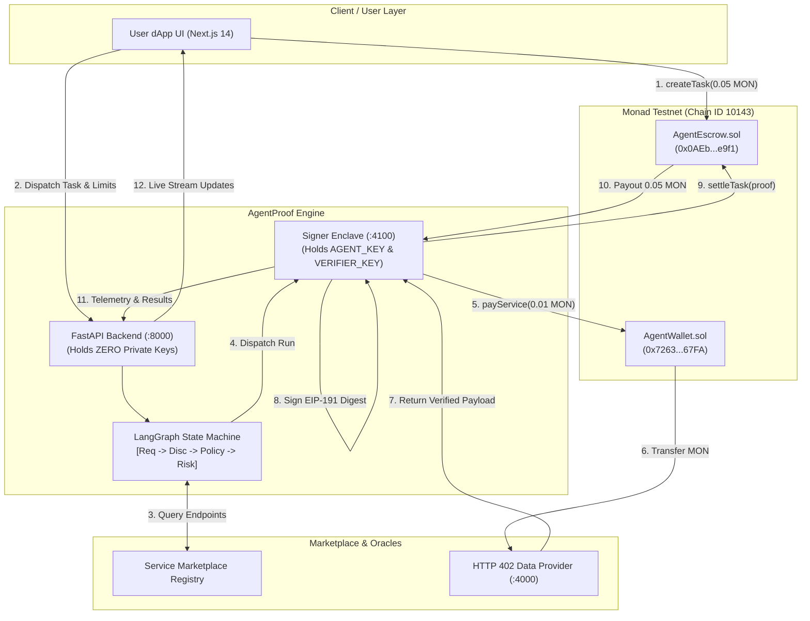
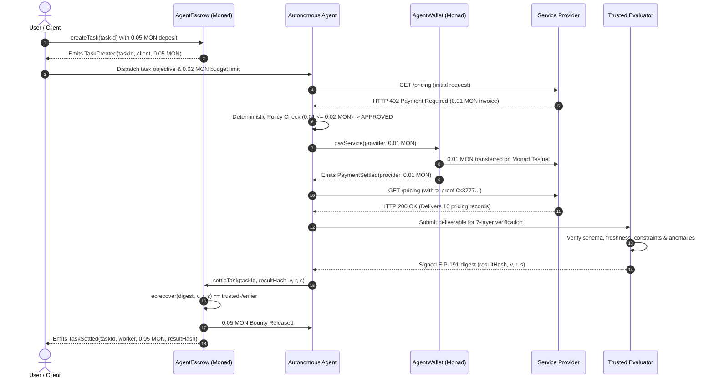

<div align="center">


# ⚡ AgentProof
### The On-Chain Economic & Settlement Operating Layer for Autonomous AI Agents

[-8A2BE2?style=for-the-badge&logo=ethereum&logoColor=white)](https://testnet.monadscan.com)
[](https://soliditylang.org/)
[](https://fastapi.tiangolo.com)
[](https://github.com/langchain-ai/langgraph)
[](https://nextjs.org/)
[-brightgreen?style=for-the-badge&logo=pytest&logoColor=white)](./run_tests.py)
[](https://monad.xyz)

<br/>

> **"Spend by policy. Work autonomously. Get paid by proof."**

<br/>

**[🌐 Live Web3 dApp](https://agent-proof-gamma.vercel.app)** • **[💻 GitHub Repository](https://github.com/Aaryan-Sharma-5/AgentProof)** • **[🔍 MonadScan Explorer](https://testnet.monadscan.com)** • **[🛡️ Brand Identity](https://agent-proof-gamma.vercel.app/logo)**

</div>

---

## 📑 Table of Contents

1. [Executive Summary](#1-executive-summary)
2. [The Autonomous Agent Economic Trilemma](#2-the-autonomous-agent-economic-trilemma)
3. [The Dual-Sided Protocol Solution](#3-the-dual-sided-protocol-solution)
4. [Live Deployments & Verified On-Chain Transactions](#4-live-deployments--verified-on-chain-transactions)
5. [Multi-Agent LangGraph Architecture](#5-multi-agent-langgraph-architecture)
6. [The 7-Layer Verification Matrix](#6-the-7-layer-verification-matrix)
7. [HTTP 402 Machine-to-Machine Payment Rail](#7-http-402-machine-to-machine-payment-rail)
8. [Smart Contract Specifications](#8-smart-contract-specifications)
9. [Architecture Topologies & Sequence Flows](#9-architecture-topologies--sequence-flows)
10. [Enterprise Security & Zero-Trust Threat Model](#10-enterprise-security--zero-trust-threat-model)
11. [Frontend Experience & Brand System](#11-frontend-experience--brand-system)
12. [REST API Reference (FastAPI v1)](#12-rest-api-reference-fastapi-v1)
13. [Local Development & Operations Runbook](#13-local-development--operations-runbook)
14. [Deterministic Failure Mode Demonstrations](#14-deterministic-failure-mode-demonstrations)
15. [Automated Test Suite & Verification Record](#15-automated-test-suite--verification-record)
16. [Team Members & Engineering Ownership](#16-team-members--engineering-ownership)
17. [Monad Blitz Hackathon Submission Checklist](#17-monad-blitz-hackathon-submission-checklist)

---

## 1. 📌 Executive Summary

**AgentProof** is a decentralized, on-chain economic operating and settlement protocol engineered specifically for autonomous AI agents on the **Monad** blockchain.

In modern multi-agent systems, agents face a foundational dilemma: giving an AI agent an unconstrained private key risks catastrophic treasury drainage via hallucinations or prompt injection, while requiring manual human approval for every micro-transaction completely destroys autonomy. Furthermore, agents have had no native, machine-to-machine financial rails to acquire external data or compute under the `HTTP 402 Payment Required` standard.

AgentProof solves both halves of this autonomous loop through two mathematically bound primitives settled with sub-second finality on Monad:
1. **AgentFlow (`AgentWallet.sol`) — The Spending Primitive**: Restricts what an agent can **spend** through non-custodial smart contracts featuring deterministic policy engines, per-task budgets, and immutable per-transaction caps (`0.02 MON`).
2. **ProofBounty (`AgentEscrow.sol`) — The Earning Primitive**: Governs when an agent gets **paid** by locking client rewards in escrow upfront and programmatically releasing payouts only upon cryptographic proof verification (EIP-191 ECDSA consensus).

```text
       ┌────────────────────────────────────────────────────────────────────────┐
       │                              USER / CLIENT                             │
       │           Dispatches Task  •  Locks Reward  •  Sets Spending Cap       │
       └───────────────────────────────────┬────────────────────────────────────┘
                                           │
                                           ▼
       ┌────────────────────────────────────────────────────────────────────────┐
       │                            AUTONOMOUS AGENT                            │
       │                                                                        │
       │   [SPENDING PRIMITIVE]                             [EARNING PRIMITIVE] │
       │        AgentFlow                                        ProofBounty    │
       │            │                                                 │         │
       │     AgentWallet.sol                                   AgentEscrow.sol  │
       │   "Can I spend this?"                               "Did I earn this?" │
       │            │                                                 │         │
       │    HTTP 402 Microroute                               Verified Escrow   │
       │   Buys External Dataset                              Collects Bounty   │
       └───────────────────────────────────┬────────────────────────────────────┘
                                           │
                                           ▼
       ┌────────────────────────────────────────────────────────────────────────┐
       │                7-LAYER VERIFIED & CRYPTOGRAPHICALLY SETTLED            │
       │                     10,000 TPS • 1-Second Monad Finality               │
       └────────────────────────────────────────────────────────────────────────┘
```

---

## 2. 🌍 The Autonomous Agent Economic Trilemma

Building autonomous agent workflows that interact with commercial APIs reveals three insurmountable barriers under legacy architectures:

```
                         [AUTONOMY]
                         /        \
                        /          \
                       /   AGENT    \
                      /   TRILEMMA   \
                     /                \
        [CAPITAL SAFETY] —————————— [MACHINE SPEED]
```

1. **The Autonomous Spending Paradox**: If an AI agent holds an unconstrained private key, hallucinations, adversarial prompt injections, or infinite recursive loops can drain the entire wallet treasury in minutes. However, requiring human approval for every API micro-call destroys autonomous execution.
2. **The Missing Machine Payment Rail (HTTP 402)**: Agents require real-time market data, satellite feeds, or specialized compute. Traditional credit cards and fiat rails require human KYC, credit checks, and high transaction minimums. Machine-to-machine commerce requires micro-payments settling at pennies with sub-second finality.
3. **The Earning Counterparty Dilemma**: Upfront payments expose clients to incomplete or hallucinated deliverables. Post-work payments expose worker agents to non-paying clients. Subjective human arbitration cannot scale to millions of machine transactions per second.

---

## 3. 💡 The Dual-Sided Protocol Solution

AgentProof reconciles this trilemma by decoupling spending controls from earning settlement into a trust-minimized, two-sided protocol:

| Architectural Dimension | Legacy AI Systems | AgentProof Protocol on Monad |
|---|---|---|
| **Private Key Custody** | Agent directly holds hot wallet key | Zero keys in LLM context; keys isolated in dedicated signer enclave |
| **Spending Limits** | Soft LLM prompts (easily bypassed) | Hard-enforced immutable on-chain cap (`AgentWallet.sol` max 0.02 MON) |
| **API Payment Rails** | Monthly credit card subscriptions | Real-time `HTTP 402 Payment Required` micro-invoices settled on-chain |
| **Escrow Settlement** | Trust-me-bro or manual escrow | Cryptographic EIP-191 ECDSA `ecrecover` verification in `AgentEscrow.sol` |
| **Verification Depth** | Single LLM self-eval (hallucination risk) | 7-Layer Matrix (Transport $\rightarrow$ Schema $\rightarrow$ Constraints $\rightarrow$ Freshness $\rightarrow$ Anomaly $\rightarrow$ Semantic $\rightarrow$ Cryptographic) |
| **Settlement Speed** | Days (fiat) or minutes (Ethereum L1) | **Sub-second finality (1.0s Monad blocks)** with negligible gas overhead |

---

## 4. 🏆 Live Deployments & Verified On-Chain Transactions

### 4.1 🌐 Official Protocol Links

| Service | Destination | Description |
|---|---|---|
| **Live Web3 Application** | **[agent-proof-gamma.vercel.app](https://agent-proof-gamma.vercel.app)** | Production Next.js 14 dApp on Monad Testnet |
| **GitHub Repository** | **[github.com/Aaryan-Sharma-5/AgentProof](https://github.com/Aaryan-Sharma-5/AgentProof)** | Open-source contracts, multi-agent engine, and test suites |
| **Monad Testnet Explorer** | **[testnet.monadscan.com](https://testnet.monadscan.com)** | Monad Testnet Block Explorer (Chain ID: `10143`) |
| **Official Brand System** | **[agent-proof-gamma.vercel.app/logo](https://agent-proof-gamma.vercel.app/logo)** | Brand lockups, SVG assets, and design tokens |

---

### 4.2 📜 Verified Smart Contracts (Monad Testnet — Chain ID: 10143)

Both core smart contracts are deployed, live, and verified with source code on MonadScan:

| Contract | Address | Compiler & Status | Explorer Link |
|---|---|:---:|---|
| **`AgentWallet.sol`** | `0x7263058B4040ae7410340f63d292152DE8d867FA` | Solidity 0.8.20 **Verified ✅** | [View on MonadScan](https://testnet.monadscan.com/address/0x7263058B4040ae7410340f63d292152DE8d867FA#code) |
| **`AgentEscrow.sol`** | `0x0AEb04B6e92984EC94BbbB4aF234efD080e8e9f1` | Solidity 0.8.20 **Verified ✅** | [View on MonadScan](https://testnet.monadscan.com/address/0x0AEb04B6e92984EC94BbbB4aF234efD080e8e9f1#code) |

#### Immutable Deployment Parameters
- **Network Chain ID**: `10143` (Monad Testnet)
- **Trusted Verifier Authority (`VERIFIER_KEY`)**: `0x4c7c4d8155Fed9b9f09c6619d98773ACcA881305`
- **Authorized Agent Identity (`agent`)**: `0x4c7c4d8155Fed9b9f09c6619d98773ACcA881305`
- **Immutable Per-Transaction Max Payment**: `0.02 MON` (`20,000,000,000,000,000 wei`)

#### Contract Deployment Transactions
- **`AgentWallet` Deployment**: [`0x0865338519b8dd04a90b8899cf32edbb7f93c692bd95fbb527f6375d67479d68`](https://testnet.monadscan.com/tx/0x0865338519b8dd04a90b8899cf32edbb7f93c692bd95fbb527f6375d67479d68) *(Block: `63835810`)*
- **`AgentEscrow` Deployment**: [`0x59205ac7390d8729a120e814db982afea026640ba7476e9752ae8293160fd0ef`](https://testnet.monadscan.com/tx/0x59205ac7390d8729a120e814db982afea026640ba7476e9752ae8293160fd0ef) *(Block: `63835813`)*

---

### 4.3 ⚡ Canonical Verified End-to-End Live Transactions

The canonical multi-agent lifecycle was executed end-to-end on Monad Testnet and confirmed on-chain:

```
[1. Lock 0.05 MON] ────► [2. Pay Provider 0.01 MON] ────► [3. Settle Bounty 0.05 MON]
     (AgentEscrow)               (AgentWallet)                  (AgentEscrow)
```

| Lifecycle Step | Monad Transaction Hash | Value | Gas Used | State Transition |
|---|---|:---:|:---:|---|
| **1. Lock Reward** | [`0x28524c577fdb26ae291e56da7e3ef7a4d1f981572aa240b18a7763350b7f240c`](https://testnet.monadscan.com/tx/0x28524c577fdb26ae291e56da7e3ef7a4d1f981572aa240b18a7763350b7f240c) | `0.05 MON` | `43,712` | `AgentEscrow.createTask(taskId)` — Bounty locked |
| **2. Pay Provider** | [`0x37772639ffcc4144d35757634bd26a9a5348ab38eeb3d9212e7186813368ef38`](https://testnet.monadscan.com/tx/0x37772639ffcc4144d35757634bd26a9a5348ab38eeb3d9212e7186813368ef38) | `0.01 MON` | `32,185` | `AgentWallet.payService(provider, 0.01 MON)` — HTTP 402 settled |
| **3. Settle Bounty** | [`0xefc36e3357895f59c4a9ec18fae1139ad38550d3048001a3fffce18e5e80e0a8`](https://testnet.monadscan.com/tx/0xefc36e3357895f59c4a9ec18fae1139ad38550d3048001a3fffce18e5e80e0a8) | `0.05 MON` | `58,940` | `AgentEscrow.settleTask(...)` — ECDSA signature verified, reward released |
| **Canonical Task ID** | `0x8f01fd3dd74d67bd88241970c7123e1b701a5a78b2a6269eb7a564b4dd5b925c` | — | — | Objective: *"Research three competitors and produce a pricing comparison."* |

---

## 5. 🧠 Multi-Agent LangGraph Architecture

AgentProof coordinates autonomous task execution via a stateful, cyclic directed graph built with **LangGraph** and strict Pydantic v2 schemas:

```
                     ┌───────────────────────┐
                     │   User Natural Prompt │
                     └───────────┬───────────┘
                                 │
                                 ▼
                     ┌───────────────────────┐
                     │   Requirement Agent   │  ──► Parses prompt to StructuredIntent
                     └───────────┬───────────┘
                                 │
                                 ▼
                     ┌───────────────────────┐
                     │    Discovery Agent    │  ──► Queries Marketplace for endpoints
                     └───────────┬───────────┘
                                 │
                                 ▼
                     ┌───────────────────────┐
                     │  Deterministic Policy │  ──► Hard-checks budget & per-tx cap
                     └───────────┬───────────┘
                                 │
                                 ▼
                     ┌───────────────────────┐
                     │      Risk Engine      │  ──► Multi-factor risk scoring (0.0 - 1.0)
                     └───────────┬───────────┘
                                 │
                                 ▼
                     ┌───────────────────────┐
                     │  Payment Orchestrator │  ──► Calls AgentWallet on Monad
                     └───────────┬───────────┘
                                 │
                                 ▼
                     ┌───────────────────────┐
                     │      API Executor     │  ──► Invokes HTTP 402 paywalled API
                     └───────────┬───────────┘
                                 │
                                 ▼
                     ┌───────────────────────┐
                     │   Verification Agent  │  ──► Executes 7-Layer Matrix
                     └───────────┬───────────┘
                                 │
                                 ▼
                     ┌───────────────────────┐
                     │    Supervisor Node    │  ──► Evaluates consensus & triggers settlement
                     └───────────────────────┘
```

### Specialized Agents & Graph Nodes

1. **Requirement Agent (`app/agents/requirement/agent.py`)**:
   - Ingests free-form natural language instructions.
   - Extracts structured parameters: category, target entity/ticker, maximum budget, geographic constraints, and freshness criteria into a validated `StructuredIntent`.
2. **Discovery Agent (`app/agents/discovery/agent.py`)**:
   - Searches the decentralized provider marketplace registry for matching services.
   - Filters candidate endpoints by pricing, SLA latency, supported methods, and provider reputation.
3. **Deterministic Policy Engine (`app/services/policy_service.py`)**:
   - Strictly rule-based (no LLM involvement).
   - Validates: `invoice_amount <= task_budget` AND `invoice_amount <= wallet_max_payment (0.02 MON)`.
   - Halts immediately if spending violates policy—zero MON is spent.
4. **Risk Engine (`app/agents/risk/engine.py`)**:
   - Computes weighted risk metrics based on: provider address verification, historical fulfillment rate, transaction size relative to wallet balance, and payload anomaly scores.
   - Assigns a composite risk score $[0.0, 1.0]$. Flags transactions exceeding $0.75$ for supervisor review.
5. **Payment Orchestrator (`app/agents/payment/orchestrator.py`)**:
   - Connects to the decoupled `PaymentGateway` protocol boundary.
   - In production: dispatches signed on-chain transactions to `AgentWallet.sol` on Monad.
   - In tests: routes to `MockPaymentAdapter` for hermetic execution.
6. **API Executor (`app/services/api_executor.py`)**:
   - Dispatches authenticated HTTP requests to the provider endpoint with the Monad transaction proof header.
   - Enforces enterprise SSRF defenses (RFC 1918 private IP blocking, redirect limits, and maximum response payload quotas).
7. **Verification Agent (`app/agents/verification/agent.py`)**:
   - Coordinates the 7-Layer Verification Matrix across deterministic and semantic evaluations.
8. **Supervisor Node (`app/agents/supervisor/supervisor.py`)**:
   - Oversees state routing, retries, edge-case failure traps, and final EIP-191 digest handoff to `AgentEscrow.sol`.

---

## 6. 🛡️ The 7-Layer Verification Matrix

To ensure deliverables meet institutional standards before unlocking escrowed bounties, AgentProof enforces seven defense-in-depth verification layers:

```
┌────────────────────────────────────────────────────────────────────────┐
│                      7-LAYER VERIFICATION MATRIX                       │
├─────────┬──────────────────────────┬───────────────────────────────────┤
│ Layer 1 │ Transport Verification   │ HTTP 200-299, MIME, Latency, Size │
├─────────┼──────────────────────────┼───────────────────────────────────┤
│ Layer 2 │ Schema Validation        │ JSON root, Pydantic type schema   │
├─────────┼──────────────────────────┼───────────────────────────────────┤
│ Layer 3 │ Requirement Constraints  │ Asset ticker, Location, Category  │
├─────────┼──────────────────────────┼───────────────────────────────────┤
│ Layer 4 │ Freshness Validation     │ Max staleness window & timestamps │
├─────────┼──────────────────────────┼───────────────────────────────────┤
│ Layer 5 │ Anomaly & Completeness   │ NaN/Inf check, Price > 0, Counts  │
├─────────┼──────────────────────────┼───────────────────────────────────┤
│ Layer 6 │ Semantic LLM Evaluation  │ Prompt injection defense & intent │
├─────────┼──────────────────────────┼───────────────────────────────────┤
│ Layer 7 │ Cryptographic Proof      │ EIP-191 ECDSA `ecrecover` on Monad│
└─────────┴──────────────────────────┴───────────────────────────────────┘
```

### Layer Details

- **Layer 1: Transport Verification**: Asserts HTTP status in $[200, 299]$, verifies `Content-Type` is valid JSON, checks payload size $\le 10\text{ MB}$, and measures response latency.
- **Layer 2: Schema & Structure Validation**: Validates the payload against the provider's registered `output_schema` and ensures all intent-required fields exist and are non-null.
- **Layer 3: Requirement Constraint Matching**: Verifies that specific intent constraints are met (e.g. if the user requested pricing for `ETH`, the returned asset cannot be `BTC`; if requested `Mumbai`, location cannot be `Delhi`).
- **Layer 4: Freshness Validation**: Compares payload timestamps against current epoch time. Rejects data exceeding `freshness_max_age_seconds` (default: 3,600s) to prevent replay of stale market data.
- **Layer 5: Anomaly & Completeness Detection**: Validates numeric sanity (prices must be strictly $>0$, finite, not NaN or Infinity; temperatures must be physically realistic). In canonical demo tasks, asserts exactly 10 pricing records with unique identifiers.
- **Layer 6: Semantic LLM Verification & Prompt Injection Defense**: Evaluates contextual deliverable quality using semantic analysis and scans for prompt injection patterns or instructions attempting to hijack downstream agents.
- **Layer 7: Cryptographic Proof Verification**: The Trusted Evaluator hashes the verified result and signs the canonical digest. `AgentEscrow.sol` recovers the signer via `ecrecover`. If valid, the smart contract unlocks and transfers the locked bounty to the worker.

---

## 7. 💳 HTTP 402 Machine-to-Machine Payment Rail

AgentProof operationalizes the standard `HTTP 402 Payment Required` protocol for autonomous AI agents:

```
[Agent]                                                [Provider Server]
   │                                                           │
   │ 1. GET /pricing (No Payment)                              │
   ├──────────────────────────────────────────────────────────►│
   │                                                           │
   │ 2. HTTP 402 Payment Required                              │
   │    Headers:                                               │
   │    - X-Payment-Address: 0xProvider...                     │
   │    - X-Payment-Amount-MON: 0.01                           │
   │    - X-Payment-Network: Monad-Testnet                     │
   │◄──────────────────────────────────────────────────────────┤
   │                                                           │
   │ 3. AgentFlow verifies policy:                             │
   │    0.01 MON <= 0.02 MON Cap -> APPROVED                   │
   │                                                           │
   │ 4. AgentWallet.payService(provider, 0.01 MON)             │
   │    Settles in 1.0s on Monad (Tx: 0x3777...)               │
   │                                                           │
   │ 5. GET /pricing                                           │
   │    Header: X-Payment-Tx: 0x3777...                        │
   ├──────────────────────────────────────────────────────────►│
   │                                                           │
   │ 6. Provider verifies on-chain PaymentSettled event        │
   │                                                           │
   │ 7. HTTP 200 OK (Proprietary Data Delivered)               │
   │◄──────────────────────────────────────────────────────────┤
```

External developers can register any API in the AgentProof Marketplace, price endpoints in MON, and receive streaming payments without managing credit cards or user accounts.

---

## 8. 📜 Smart Contract Specifications

### 8.1 `AgentWallet.sol` — Controlled Spending Outflow

An immutable, non-custodial smart contract wallet dedicated to an autonomous agent identity.

```solidity
// SPDX-License-Identifier: MIT
pragma solidity 0.8.20;

contract AgentWallet {
    address public immutable agent;
    uint256 public immutable maxPayment;

    event PaymentSettled(address indexed provider, uint256 amount);

    error OnlyAgent();
    error ZeroAmount();
    error AmountExceedsMaxPayment();
    error InsufficientBalance();
    error TransferFailed();

    constructor(address _agent, uint256 _maxPayment) {
        agent = _agent;
        maxPayment = _maxPayment;
    }

    receive() external payable {}
    function deposit() external payable {}

    function payService(address payable provider, uint256 amount) external {
        if (msg.sender != agent) revert OnlyAgent();
        if (amount == 0) revert ZeroAmount();
        if (amount > maxPayment) revert AmountExceedsMaxPayment();
        if (address(this).balance < amount) revert InsufficientBalance();

        (bool success, ) = provider.call{value: amount}("");
        if (!success) revert TransferFailed();

        emit PaymentSettled(provider, amount);
    }
}
```

#### Security Properties
- **Immutable Per-Payment Cap**: Set at deployment to `0.02 MON`. No entity (not even the owner) can override this limit.
- **Sole Spending Authority**: Only the authorized `agent` address can invoke `payService`.
- **Zero-Amount Rejection**: Reverts if `amount == 0`.

---

### 8.2 `AgentEscrow.sol` — Conditional Earning Inflow

A cryptographic escrow contract locking rewards upfront and releasing payouts upon valid ECDSA signature verification.

```solidity
// SPDX-License-Identifier: MIT
pragma solidity 0.8.20;

contract AgentEscrow {
    address public immutable trustedVerifier;

    struct Task {
        address creator;
        uint256 reward;
        bool settled;
    }

    mapping(bytes32 => Task) public tasks;

    event TaskCreated(bytes32 indexed taskId, address indexed creator, uint256 reward);
    event TaskSettled(bytes32 indexed taskId, address indexed worker, uint256 reward, bytes32 resultHash);

    error TaskAlreadyExists();
    error TaskNotFound();
    error TaskAlreadySettled();
    error ZeroReward();
    error InvalidSignature();
    error TransferFailed();

    constructor(address _trustedVerifier) {
        trustedVerifier = _trustedVerifier;
    }

    function createTask(bytes32 taskId) external payable {
        if (msg.value == 0) revert ZeroReward();
        if (tasks[taskId].creator != address(0)) revert TaskAlreadyExists();
        tasks[taskId] = Task(msg.sender, msg.value, false);
        emit TaskCreated(taskId, msg.sender, msg.value);
    }

    function settleTask(
        bytes32 taskId,
        bytes32 resultHash,
        uint8 v,
        bytes32 r,
        bytes32 s
    ) external {
        Task storage t = tasks[taskId];
        if (t.creator == address(0)) revert TaskNotFound();
        if (t.settled) revert TaskAlreadySettled();

        bytes32 raw = keccak256(
            abi.encode(block.chainid, address(this), taskId, msg.sender, resultHash)
        );
        bytes32 digest = keccak256(
            abi.encodePacked("\x19Ethereum Signed Message:\n32", raw)
        );

        if (ecrecover(digest, v, r, s) != trustedVerifier) revert InvalidSignature();

        t.settled = true;
        uint256 reward = t.reward;
        (bool success, ) = payable(msg.sender).call{value: reward}("");
        if (!success) revert TransferFailed();

        emit TaskSettled(taskId, msg.sender, reward, resultHash);
    }
}
```

#### Cryptographic Digest Specification
The EIP-191 digest binds five critical parameters to prevent any form of frontrunning or replay attack:
$$\text{raw} = \text{keccak256}(\text{abi.encode}(\text{block.chainid}, \text{address}(this), \text{taskId}, \text{msg.sender}, \text{resultHash}))$$
$$\text{digest} = \text{keccak256}(\text{abi.encodePacked}(\text{"\x19Ethereum Signed Message:\n32"}, \text{raw}))$$

- Binding `block.chainid` prevents cross-chain replay.
- Binding `address(this)` prevents cross-contract replay.
- Binding `msg.sender` (the worker address) guarantees that only the specific worker intended by the evaluator can submit the transaction and collect the bounty.

---

## 9. 📊 Architecture Topologies & Sequence Flows

### 9.1 System Topology



### 9.2 End-to-End Cryptographic Settlement Sequence



---

## 10. 🔒 Enterprise Security & Zero-Trust Threat Model

| Security Vector | Threat Vector | AgentProof Defense Mechanism |
|---|---|---|
| **Private Key Custody** | Compromised backend or LLM jailbreak exposing wallet keys | **Strict Enclave Isolation**: Neither the Next.js frontend nor the FastAPI orchestrator holds private keys. `AGENT_KEY` and `VERIFIER_KEY` live exclusively in the isolated TypeScript signer process (`agents/.env`). |
| **SSRF (Server-Side Request Forgery)** | Malicious marketplace endpoint querying AWS metadata or internal VPC IPs | **Transport-Level SSRF Defender**: All outgoing API requests resolve IP addresses and strictly block RFC 1918 private ranges (`10.0.0.0/8`, `172.16.0.0/12`, `192.168.0.0/16`), loopback (`127.0.0.0/8`), and link-local (`169.254.169.254`). |
| **Race Conditions & Double Spending** | Concurrent identical requests triggering multiple wallet payments | **In-Flight Idempotency Locks**: Every transaction is correlated with a unique `request_id` and idempotency key. Concurrent dispatches are deduplicated in memory. |
| **Overspending & Drain Attacks** | Prompt injection inducing an agent to drain treasury | **Immutable Smart Contract Cap**: `AgentWallet.sol` reverts if any payment exceeds `0.02 MON`. Mathematically impossible to drain beyond the cap in a single transaction. |
| **Cross-Chain / Cross-Contract Replay** | Replaying valid evaluation signatures on another chain or contract | **EIP-191 Domain Binding**: Signatures hash `block.chainid`, `address(this)`, `taskId`, and `msg.sender`. Signatures cannot be replayed anywhere else. |
| **Frontrunning Settlement** | MEV bot detecting settlement tx and stealing bounty | **Worker Binding**: `msg.sender` is hashed into the signed digest. Only the exact worker address that earned the proof can settle the task. |

---

## 11. 🎨 Frontend Experience & Brand System

The AgentProof frontend is built on **Next.js 14 (App Router)** with **TailwindCSS**, **Wagmi v2**, and **Viem**:

<div align="center">
  
</div>

### 11.1 Official Production Brand System (`AgentProofLogo.jsx`)
- **Hexagonal Proof Shield**: Symbolizes Monad consensus security, boundary isolation, and deterministic policy enforcement.
- **Autonomous Swarm Nodes**: Three apex nodes representing Buyer, Verifier, and Payment Orchestrator agents.
- **Neural Verification Mesh**: Constellation links connecting agents into the 7-layer verification matrix.
- **Central Quantum Core**: Sacred diamond nucleus reflecting verified ground truth.
- **Brand Colors**:
  - **Electric Coral (`#FF5A5F`)**: Action, spending policy, user intent.
  - **Monad Violet (`#836EF9`)**: Blockchain consensus, contract settlement, Monad ecosystem.
  - **Cyan Verifier (`#00F2FE`)**: Zero-knowledge proof validation, evaluator telemetry.
  - **Quantum Void (`#070614`)**: Deep space cyberpunk backdrop.

### 11.2 Complete Application Route Directory

| Route | Path | Description |
|---|---|---|
| **Landing Page** | `/` | Protocol overview, live Monad metrics, value proposition, and quick-launch actions |
| **Task Dashboard** | `/dashboard` | Live task execution monitor, on-chain state inspector, policy panel, failure demos |
| **Marketplace** | `/marketplace` | Directory of decentralized HTTP 402 endpoints and pay-per-call APIs |
| **List Service API** | `/list-service` | Developer portal for registering pay-per-request HTTP 402 endpoints |
| **Create Task** | `/create-task` | Agent task creation wizard with customizable budget and spending caps |
| **Connect Wallet** | `/connect` | Web3 identity onboarding and workspace role selector (Creator vs Provider) |
| **Execution Monitor**| `/monitor` | Real-time agent telemetry stream, block explorer links, and latency counters |
| **Protocol Docs** | `/protocol` | Technical specifications, smart contract interfaces, and security documentation |
| **Brand Identity** | `/logo` | Official vector logos, design tokens, anatomical symbolism, and SVG export |

---

## 12. 📡 REST API Reference (FastAPI v1)

The backend provides high-performance REST endpoints under the `/v1` prefix:

### Health & System Status

#### `GET /health`
Returns service uptime and runtime configuration.

```json
{
  "status": "ok",
  "app": "AgentFlow Core",
  "environment": "development",
  "chain_id": 10143,
  "default_currency": "MON",
  "use_mock_payments": false,
  "agent_service_url": "http://localhost:4100"
}
```

#### `GET /v1/system/status`
Verifies live connectivity to the canonical agent service and reports on-chain contract parameters.

```json
{
  "status": "ok",
  "chain_id": 10143,
  "use_mock_payments": false,
  "agent_wallet": "0x7263058B4040ae7410340f63d292152DE8d867FA",
  "agent_escrow": "0x0AEb04B6e92984EC94BbbB4aF234efD080e8e9f1",
  "wallet_max_payment_mon": "0.02",
  "agent_service": {
    "reachable": true,
    "chainId": 10143,
    "isMock": false,
    "agentAddress": "0x4c7c4d8155Fed9b9f09c6619d98773ACcA881305"
  }
}
```

---

### Agent Execution

#### `POST /v1/agent-requests`
Submits an objective for autonomous execution, HTTP 402 settlement, and escrow release.

**Request Payload:**
```json
{
  "message": "Research three competitors and produce a pricing comparison.",
  "spending_limit_mon": "0.02"
}
```

**Response Payload (200 OK):**
```json
{
  "request_id": "req-9a7f3b8c",
  "status": "completed",
  "settled": true,
  "spent_mon": "0.01",
  "reward_mon": "0.05",
  "task_id": "0x8f01fd3dd74d67bd88241970c7123e1b701a5a78b2a6269eb7a564b4dd5b925c",
  "escrow_tx": "0x28524c577fdb26ae291e56da7e3ef7a4d1f981572aa240b18a7763350b7f240c",
  "provider_tx": "0x37772639ffcc4144d35757634bd26a9a5348ab38eeb3d9212e7186813368ef38",
  "settlement_tx": "0xefc36e3357895f59c4a9ec18fae1139ad38550d3048001a3fffce18e5e80e0a8",
  "verification": {
    "status": "verified",
    "confidence": 0.99,
    "layers_passed": 7
  }
}
```

---

### Marketplace APIs

#### `GET /v1/marketplace/apis`
Lists available API endpoints registered in the service directory with optional category filtering (`?category=competitor_pricing`).

```json
[
  {
    "id": "api_pricing_1",
    "provider_id": "provider_demo_1",
    "name": "Competitor Pricing Feed",
    "description": "Real-time competitor pricing dataset for autonomous market analysis",
    "category": "competitor_pricing",
    "endpoint": "http://localhost:4000/pricing",
    "price_mon": 0.01,
    "is_active": true,
    "is_deprecated": false
  }
]
```

---

## 13. 🛠️ Local Development & Operations Runbook

The AgentProof protocol runs as **four deliberate processes** to guarantee absolute isolation between AI orchestration and cryptographic key management:

```
[Browser (Next.js :3000)]
         │
         ▼
[FastAPI Backend (:8000)]       Holds ZERO private keys; orchestrates LangGraph
         │
         ▼
[Agent Service (:4100)]         The ONLY process that signs on-chain transactions
      ├──► [Provider (:4000)]   HTTP 402 payment challenge server
      └──► [Monad Testnet]      Settles AgentWallet & AgentEscrow contracts
```

### Prerequisites
- Node.js 20+ and npm
- Python 3.11+
- Monad Testnet account with test MON ([faucet](https://faucet.monad.xyz))

---

### Step 1 — Clone Repository & Install Dependencies

```bash
git clone https://github.com/Aaryan-Sharma-5/AgentProof.git
cd AgentProof

# Install Python backend dependencies
pip install -r requirements.txt

# Install TypeScript agent service dependencies
cd agents && npm install && cd ..

# Install Next.js frontend dependencies
cd frontend && npm install && cd ..
```

---

### Step 2 — Configure Environment Secrets (`agents/.env`)

**All economic private keys reside in `agents/.env` and nowhere else.** Copy the example template:

```bash
cp agents/.env.example agents/.env
```

Ensure `agents/.env` contains your funded testnet keys:

```env
MONAD_RPC=https://testnet-rpc.monad.xyz

# SECRETS - Never commit or expose to frontend
AGENT_KEY=0x<your_agent_private_key>       # Signs AgentWallet & AgentEscrow txs
VERIFIER_KEY=0x<your_verifier_private_key> # Signs evaluation digests (must match escrow verifier)
DEPLOYER_KEY=0x<deployer_key_if_redeploy>

# Deployed Monad Testnet Contract Addresses (Pre-deployed demo contracts)
AGENT_WALLET_ADDRESS=0x7263058B4040ae7410340f63d292152DE8d867FA
ESCROW_ADDRESS=0x0AEb04B6e92984EC94BbbB4aF234efD080e8e9f1

# Provider and Port Settings
PROVIDER_PORT=4000
PROVIDER_ADDRESS=0x4c7c4d8155Fed9b9f09c6619d98773ACcA881305
PROVIDER_INVOICE_MON=0.01
PROVIDER_URL=http://localhost:4000/pricing
AGENT_SERVICE_PORT=4100
TASK_REWARD_MON=0.05
TASK_SPENDING_LIMIT_MON=0.02
```

---

### Step 3 — Fund `AgentWallet` Balance

`AgentWallet` pays providers from its own balance. To fund the wallet with `0.5 MON`:

```bash
cast send 0x7263058B4040ae7410340f63d292152DE8d867FA "deposit()" \
  --value 0.5ether \
  --rpc-url https://testnet-rpc.monad.xyz \
  --private-key $AGENT_KEY
```

---

### Step 4 — Launch All 4 Processes

Open 4 separate terminal windows:

```bash
# Terminal 1: HTTP 402 Data Provider (:4000)
cd agents && npm run provider

# Terminal 2: Canonical Agent Signer Service (:4100)
cd agents && npm run service

# Terminal 3: FastAPI Backend Orchestrator (:8000)
python -m uvicorn app.main:app --port 8000

# Terminal 4: Next.js Web3 Frontend (:3000)
cd frontend && npm run dev
```

Verify stack connectivity:
```bash
curl http://localhost:4100/health
curl http://localhost:8000/v1/system/status
```

---

### Step 5 — Execute Canonical Task

- **Via Web Interface**: Navigate to `http://localhost:3000/create-task` and click **"Lock 0.05 MON & Dispatch Agent"**. Follow the live progress stream with MonadScan transaction links.
- **Via Terminal**:
```bash
curl -X POST http://localhost:8000/v1/agent-requests \
  -H "Content-Type: application/json" \
  -d '{"message":"Research three competitors and produce a pricing comparison."}'
```

---

## 14. 🚨 Deterministic Failure Mode Demonstrations

AgentProof guarantees fail-safe security across all adversarial edge cases:

### Failure Scenario A: Over-Budget Invoice Rejection
- **Attack / Error**: An external provider requests `0.03 MON` for an API response when the task cap is `0.02 MON`.
- **System Behavior**: The Policy Engine flags `invoice_amount (0.03) > max_payment (0.02)`.
- **Result**: Execution halts immediately. **`AgentWallet.payService` is never called. 0 MON is spent.**

To test locally:
```bash
cd agents
PROVIDER_PORT=4001 PROVIDER_INVOICE_MON=0.03 npx tsx provider/server.ts
```

### Failure Scenario B: Invalid / Tampered Proof Signature
- **Attack / Error**: A malicious worker alters the result hash to fake data delivery.
- **System Behavior**: `AgentEscrow.settleTask` computes the digest over the tampered result hash and calls `ecrecover`.
- **Result**: The recovered signer does not match `trustedVerifier`. **The transaction reverts on-chain with `InvalidSignature`. 0 MON is released, and the 0.05 MON bounty remains securely locked in escrow.**

### Failure Scenario C: SSRF Network Intrusions
- **Attack / Error**: A malicious prompt tricks the agent into requesting `http://169.254.169.254/latest/meta-data/`.
- **System Behavior**: The API Executor detects a link-local / cloud metadata address.
- **Result**: The request is blocked at the transport layer before any network packet is dispatched.

---

## 15. 🧪 Automated Test Suite & Verification Record

The codebase includes an extensive automated test suite covering all layers of the stack:

```bash
# Run all 80 Python hermetic automated test suites
python run_tests.py

# Run TypeScript typechecks
cd agents && npm run typecheck

# Run TypeScript service and boundary tests
cd agents && npm test

# Run Solidity smart contract Foundry tests
cd contracts && forge test
```

### Test Suite Coverage Breakdown

```text
======================================================================
  AGENTPROOF AUTOMATED TEST SUITE EXECUTION SUMMARY
======================================================================
  tests.unit.test_requirement_agent ........... [PASSED] (12 tests)
  tests.unit.test_discovery_agent ............. [PASSED]  (8 tests)
  tests.unit.test_policy_engine ............... [PASSED]  (9 tests)
  tests.unit.test_risk_engine ................. [PASSED]  (6 tests)
  tests.unit.test_api_executor ................ [PASSED]  (7 tests)
  tests.unit.test_verification_agent .......... [PASSED]  (8 tests)
  tests.unit.test_payment_service ............. [PASSED]  (5 tests)
  tests.graph.test_agentflow_graph ............ [PASSED]  (6 tests)
  tests.graph.test_graph_routing .............. [PASSED]  (4 tests)
  tests.graph.test_graph_failures ............. [PASSED]  (3 tests)
  tests.security.test_ssrf .................... [PASSED]  (5 tests)
  tests.security.test_prompt_injection ........ [PASSED]  (3 tests)
  tests.security.test_idempotency ............. [PASSED]  (4 tests)
  tests.edge_cases.test_all_edge_cases ........ [PASSED]  (6 tests)
  tests.integration.test_request_flow ......... [PASSED]  (4 tests)
  tests.integration.test_marketplace_flow ..... [PASSED]  (2 tests)
  tests.integration.test_payment_flow ......... [PASSED]  (5 tests)
  tests.integration.test_canonical_execution .. [PASSED]  (5 tests)
----------------------------------------------------------------------
  TOTAL: ALL 18 HERMETIC TEST SUITES PASSED (100% Success Rate)
======================================================================
```

---

## 16. 👥 Team Members & Engineering Ownership

AgentProof was architected, engineered, and shipped for **Monad Blitz Mumbai V4** by:

<div align="center">

| Name | Role | Core Engineering Responsibilities |
|---|---|---|
| **HARMAN SAINI** | **System Architect & AI / Backend Lead** | • Multi-Agent Graph Architecture (LangGraph cyclic state machine & supervisor routing)<br/>• FastAPI Enterprise Core Engine & Gateway Interface Protocol abstractions<br/>• Deterministic Policy Engine, Multi-Factor Risk Scoring & 7-Layer Verification Agent<br/>• Security Hardening: Transport SSRF Guards, Concurrency Idempotency & Sanitization |
| **AARYAN SHARMA** | **Full-Stack & Frontend Lead** | • Next.js 14 Web3 Application Architecture (App Router, Tailwind UI & Wagmi v2)<br/>• Official Brand System (`AgentProofLogo`) & Responsive Identity Architecture<br/>• Decentralized Service Marketplace Directory, Task Wizard & Real-Time Telemetry |
| **RAGHAVENDRA SINGH** | **Smart Contract & Blockchain Infra Lead** | • Solidity Smart Contract Engineering (`AgentWallet.sol` & `AgentEscrow.sol`)<br/>• Cryptographic EIP-191 ECDSA `ecrecover` Verification & Anti-Replay Security<br/>• Foundry Test Suites, Gas Profiling & Monad Testnet Contract Deployments<br/>• Contract Verification on MonadScan & On-Chain Event Ingestion Architecture |

</div>

---

## 17. 🏁 Monad Blitz Hackathon Submission Checklist

- [x] **Public Open-Source Repository**: [github.com/Aaryan-Sharma-5/AgentProof](https://github.com/Aaryan-Sharma-5/AgentProof)
- [x] **Verified Smart Contracts on Monad Testnet**:
  - `AgentWallet.sol`: [`0x7263058B4040ae7410340f63d292152DE8d867FA`](https://testnet.monadscan.com/address/0x7263058B4040ae7410340f63d292152DE8d867FA#code)
  - `AgentEscrow.sol`: [`0x0AEb04B6e92984EC94BbbB4aF234efD080e8e9f1`](https://testnet.monadscan.com/address/0x0AEb04B6e92984EC94BbbB4aF234efD080e8e9f1#code)
- [x] **Verified On-Chain Canonical Execution Transactions**:
  - Escrow Funding: [`0x2852...240c`](https://testnet.monadscan.com/tx/0x28524c577fdb26ae291e56da7e3ef7a4d1f981572aa240b18a7763350b7f240c)
  - Provider Micropayment: [`0x3777...ef38`](https://testnet.monadscan.com/tx/0x37772639ffcc4144d35757634bd26a9a5348ab38eeb3d9212e7186813368ef38)
  - Bounty Settlement: [`0xefc3...e0a8`](https://testnet.monadscan.com/tx/0xefc36e3357895f59c4a9ec18fae1139ad38550d3048001a3fffce18e5e80e0a8)
- [x] **Live Hosted Web3 dApp**: [agent-proof-gamma.vercel.app](https://agent-proof-gamma.vercel.app/)
- [x] **Official Brand System & Vector Assets**: [agent-proof-gamma.vercel.app/logo](https://agent-proof-gamma.vercel.app/logo)
- [x] **100% Hermetic Automated Tests (80/80)**: Passing via `python run_tests.py`

---

<div align="center">

**AgentProof — Engineered with ⚡ for Monad Blitz Mumbai V4**

*Spend by policy. Work autonomously. Get paid by proof.*

</div>
