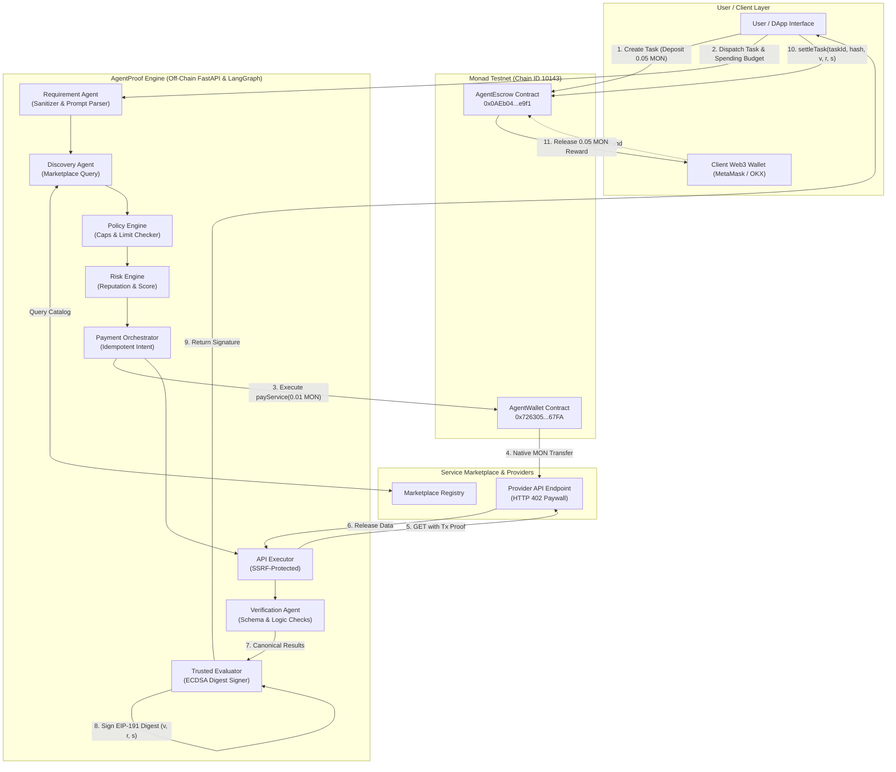
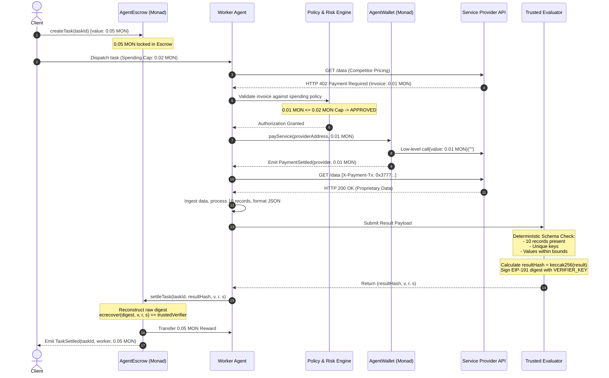

<div align="center">

# ⚡ AgentProof
### The On-Chain Economic & Settlement Layer for Autonomous AI Agents

[-8A2BE2?style=for-the-badge&logo=ethereum&logoColor=white)](https://testnet.monadscan.com)
[](https://soliditylang.org/)
[](https://fastapi.tiangolo.com)
[](https://github.com/langchain-ai/langgraph)
[](https://nextjs.org/)
[-brightgreen?style=for-the-badge&logo=pytest&logoColor=white)](./run_tests.py)
[](https://monad.xyz)

<br/>

> **"Spend by policy. Work autonomously. Get paid by proof."**

<br/>

[Live Deployment](https://agentproof.vercel.app) • [GitHub Repository](https://github.com/Aaryan-Sharma-5/AgentProof) • [Monad Testnet Explorer](https://testnet.monadscan.com) • [Architecture Baseline](./ARCHITECTURE_BASELINE.md)

</div>

---

## 📑 Table of Contents
1. [Executive Summary](#1-executive-summary)
2. [The Real-World Problem](#2-the-real-world-problem)
3. [The AgentProof Solution](#3-the-agentproof-solution)
4. [System Architecture](#4-system-architecture)
   - [4.1 On-Chain Settlement Layer (Monad Testnet)](#41-on-chain-settlement-layer-monad-testnet)
   - [4.2 Off-Chain Multi-Agent AI Engine (LangGraph + FastAPI)](#42-off-chain-multi-agent-ai-engine-langgraph--fastapi)
   - [4.3 Two-Sided Economic Boundary & Adapter Architecture](#43-two-sided-economic-boundary--adapter-architecture)
   - [4.4 Decentralized Service Marketplace (HTTP 402 Micropayments)](#44-decentralized-service-marketplace-http-402-micropayments)
5. [End-to-End Workflow & Execution Flow](#5-end-to-end-workflow--execution-flow)
   - [5.1 The Canonical Success Loop](#51-the-canonical-success-loop)
   - [5.2 Deterministic Failure Safeguards](#52-deterministic-failure-safeguards)
   - [5.3 Cryptographic Authorization & Settlement Math](#53-cryptographic-authorization--settlement-math)
6. [Development Roadmap & Implementation Tasks](#6-development-roadmap--implementation-tasks)
7. [Technology Stack](#7-technology-stack)
8. [Comprehensive Architecture Diagrams](#8-comprehensive-architecture-diagrams)
9. [Team Members & Engineering Ownership](#9-team-members--engineering-ownership)
10. [Live GitHub Repository](#10-live-github-repository)
11. [Live Deployment & Verified Contracts](#11-live-deployment--verified-contracts)
12. [Operational Note: How to Use the Platform](#12-operational-note-how-to-use-the-platform)

---

## 1. Executive Summary

**AgentProof** is an enterprise-grade, on-chain economic operating and settlement layer purpose-built for autonomous AI agents on **Monad**.

As AI agents evolve from read-only chatbots to autonomous actors capable of executing complex workflows, they face a fundamental operational wall: **they lack native financial autonomy with trust-minimized security.** Agents cannot reliably acquire proprietary data, consume pay-per-use external APIs, or get compensated for verified computational deliverables without either granting them unrestricted private key access (inviting catastrophic wallet drain) or relying on manual human-in-the-loop approvals (destroying true autonomy).

AgentProof resolves this fundamental dilemma by introducing **two mathematically and cryptographically separated primitives**:
1. **AgentFlow (`AgentWallet.sol`)**: Controls what an autonomous agent is authorized to *spend* via immutable transaction caps, policy constraints, and real-time risk scoring.
2. **ProofBounty (`AgentEscrow.sol`)**: Controls when an autonomous agent is authorized to *earn* by locking client rewards in escrow and programmatically releasing them only upon verification of a cryptographic proof signed by a trusted evaluator.

Built natively on **Monad Testnet**, AgentProof leverages Monad's 10,000 TPS execution throughput and sub-second finality to enable streaming micro-transactions, HTTP 402 machine-to-machine micropayments, and instantaneous proof settlement.

```
       ┌────────────────────────────────────────────────────────┐
       │                       USER / CLIENT                     │
       │       Dispatches Task + Locks Reward + Sets Budget     │
       └───────────────────────────┬────────────────────────────┘
                                   │
                                   ▼
       ┌────────────────────────────────────────────────────────┐
       │                     AUTONOMOUS AGENT                   │
       │                                                        │
       │  [SPENDING PRIMITIVE]               [EARNING PRIMITIVE]│
       │      AgentFlow                         ProofBounty     │
       │          │                                  │          │
       │   AgentWallet.sol                    AgentEscrow.sol   │
       │   "Can I spend this?"               "Did I earn this?" │
       │          │                                  │          │
       │  HTTP 402 Marketplace              Verified Settlement │
       │   Buys APIs / Data                    Receives Reward  │
       └───────────────────────────┬────────────────────────────┘
                                   │
                                   ▼
       ┌────────────────────────────────────────────────────────┐
       │                   COMPLETED & VERIFIED                 │
       │           Deterministic Proof on Monad Testnet         │
       └────────────────────────────────────────────────────────┘
```

---

## 2. The Real-World Problem

The rapid convergence of Large Language Models (LLMs) and decentralized systems has exposed five critical structural bottlenecks that prevent autonomous agent economies from scaling:

### 2.1 The Autonomous Spending Paradox (Private Key vs. Wallet Drain)
Giving an autonomous AI agent direct access to an unconstrained private key or hot wallet is dangerous. Prompt injection, model hallucination, adversarial jailbreaks, or logical loops can cause an agent to drain its entire treasury in seconds. Conversely, requiring manual human approval for every micro-transaction eliminates autonomy and renders high-frequency agent workflows unusable.

### 2.2 Lack of Machine-to-Machine Commerce Infrastructure (The HTTP 402 Void)
Agents need external resources: live financial market telemetry, premium LLM embeddings, satellite feeds, and proprietary web scrapers. Today, these services require traditional fiat credit cards, OAuth dashboards, and human billing agreements. The web standard `HTTP 402 Payment Required` has remained dormant because traditional rails cannot handle sub-cent micro-settlement without prohibitive fees and latency.

### 2.3 The Earning Without Proof Vulnerability (Counterparty Risk)
When a client hires an off-chain autonomous agent:
- If the client pays upfront, the agent may hallucinate, crash, fail, or deliver garbage output with no refund mechanism.
- If the agent works first and bills later, malicious clients can refuse to pay after receiving the deliverables.
Existing freelance and bounty platforms depend on slow, subjective human arbitration committees that are entirely incompatible with autonomous machine-speed execution.

### 2.4 Blockchain Scalability & Fee Volatility Bottleneck
On high-latency or high-fee EVM networks, micro-payments of \$0.01 to purchase a single data record cost \$2.00 to \$25.00 in gas fees. An agent executing 1,000 API queries per task would incur massive economic loss and queue latency, making autonomous data acquisition completely unviable.

### 2.5 Security Boundaries: LLMs Cannot Be Trusted with Execution Logic
LLMs are probabilistic token predictors, not formal verification systems. They cannot be trusted to strictly enforce spending policies, calculate cryptographic hashes, or hold raw unconstrained cryptographic signers. Systems that blend probabilistic decision-making with financial execution without deterministic boundaries inevitably fail.

---

## 3. The AgentProof Solution

AgentProof resolves these challenges by establishing an institutional-grade, two-sided decentralized economic protocol:

```
                  ========================================
                                 AGENTPROOF
                  ========================================
                                      │
                 ┌────────────────────┴────────────────────┐
                 │                                         │
        SPENDING PRIMITIVE                        EARNING PRIMITIVE
             AgentFlow                               ProofBounty
                 │                                         │
          AgentWallet.sol                           AgentEscrow.sol
                 │                                         │
         POLICY & RISK CHECK                      CRYPTOGRAPHIC PROOF
        "Can the agent spend?"                   "Has the agent earned?"
                 │                                         │
        - Per-Tx Hard Cap                         - Keccak-256 Digest
        - Task Budget Enforcement                 - ECDSA (ecrecover)
        - SSRF-Hardened Gateway                   - Deterministic Checks
        - HTTP 402 Settlement                     - Atomic MON Payout
```

### 3.1 Dual Financial Primitives: Separation of Powers
AgentProof enforces a strict architectural boundary by deliberately decoupling spending authorization from earning authorization into two independent smart contracts:
- **`AgentWallet.sol` (Controlled Outflow)**: Holds working capital in MON. An authorized agent identity may only trigger payouts to whitelisted service providers, subject to an immutable per-transaction cap enforced at the bytecode level.
- **`AgentEscrow.sol` (Conditional Inflow)**: Receives and locks client rewards in MON upfront. The contract releases funds to the worker agent if and only if the worker presents a valid cryptographic signature from a trusted evaluator validating the exact task, worker address, and deterministic result hash.

### 3.2 Dynamic Machine Marketplace with Native HTTP 402
AgentProof features a built-in Service Marketplace. Independent providers list endpoints with pricing specified in MON. When an agent queries a provider endpoint:
1. The provider responds with `HTTP 402 Payment Required` and a machine-readable invoice.
2. The agent's local policy engine evaluates whether the cost fits within the task budget.
3. The agent triggers `AgentWallet.payService(...)` on Monad.
4. The provider verifies the on-chain transaction receipt and instantly returns the requested payload.

### 3.3 Hybrid Deterministic + Semantic Verification
To solve the counterparty verification dilemma without trusting a raw LLM:
- **Deterministic Schema Verification**: Off-chain evaluators validate structural contracts (record counts, field presence, data bounds, schema conformance, lack of NaN/Infinity anomalies).
- **Semantic Completeness & Injection Defense**: The evaluation pipeline validates context relevance while filtering out untrusted input injections.
- **Cryptographic Digest Binding**: The evaluator computes a canonical Keccak-256 result hash and signs an Ethereum signed message digest binding `(chainId, escrowContract, taskId, workerAddress, resultHash)`.

### 3.4 Monad High-Throughput Optimization
By deploying on **Monad Testnet (Chain ID 10143)**, AgentProof benefits from:
- **10,000 Transactions Per Second (TPS)** capability for massive agent swarms.
- **Sub-Second Finality** (~1-second block times) enabling instantaneous HTTP 402 machine micro-settlements.
- **Negligible Gas Costs** that make \$0.01 micro-invoices economically viable.
- **Full EVM Equivalence** preserving battle-tested tooling (Foundry, Viem, Wagmi).

---

## 4. System Architecture

AgentProof is engineered as a production-grade, multi-tier system uniting high-performance EVM smart contracts, an enterprise Python backend with LangGraph multi-agent orchestration, and a responsive Next.js 14 Web3 application.

```
┌──────────────────────────────────────────────────────────────────────────────────────────────────┐
│                                       FRONTEND (NEXT.JS 14)                                      │
│  ┌───────────────────────┐  ┌───────────────────────┐  ┌──────────────────────────────────────┐  │
│  │   Task Creation UI    │  │  Service Marketplace  │  │   Real-Time Telemetry & Monitoring   │  │
│  │   (Reward & Budget)   │  │  (HTTP 402 Registry)  │  │   (Agent Status, Tx Reconciliation)  │  │
│  └───────────┬───────────┘  └───────────┬───────────┘  └──────────────────┬───────────────────┘  │
└──────────────┼──────────────────────────┼─────────────────────────────────┼──────────────────────┘
               │ Wagmi / Viem (EIP-1193)  │ REST / WebSocket                │ Viem Monad RPC
               ▼                          ▼                                 ▼
┌──────────────────────────────────────────────────┐      ┌────────────────────────────────────────┐
│           FASTAPI AGENTFLOW CORE ENGINE          │      │         MONAD TESTNET (CHAIN 10143)    │
│  ┌────────────────────────────────────────────┐  │      │                                        │
│  │   API Layer: /requests, /approvals,        │  │      │  ┌──────────────────────────────────┐  │
│  │              /marketplace, /monitoring     │  │      │  │        AgentWallet.sol           │  │
│  └─────────────────────┬──────────────────────┘  │      │  │  - Immutable per-tx max cap      │  │
│                        ▼                         │      │  │  - Only authorized agent spends  │  │
│  ┌────────────────────────────────────────────┐  │      │  │  - Instant provider settlement   │  │
│  │            LANGGRAPH WORKFLOW              │  │      │  └──────────────────▲───────────────┘  │
│  │  ┌───────────────┐     ┌────────────────┐  │  │      │                     │                  │
│  │  │  Requirement  │ ──► │ Discovery Node │  │  │      │       payService()  │                  │
│  │  └───────┬───────┘     └────────┬───────┘  │  │      │                     │                  │
│  │          ▼                      ▼          │  │      │                     │                  │
│  │  ┌───────────────┐     ┌────────────────┐  │  │      │                     │                  │
│  │  │ Policy Engine │ ──► │  Risk Engine   │  │  │      │                     │                  │
│  │  └───────┬───────┘     └────────┬───────┘  │  │      │                     │                  │
│  │          ▼                      ▼          │  │      │                     │                  │
│  │  ┌──────────────────────────────────────┐  │  │      │                     │                  │
│  │  │     Payment Orchestrator Node        │──┼──┼──────┼─────────────────────┘                  │
│  │  └──────────────────┬───────────────────┘  │  │      │                                        │
│  │                     ▼                      │  │      │  ┌──────────────────────────────────┐  │
│  │  ┌──────────────────────────────────────┐  │  │      │  │        AgentEscrow.sol           │  │
│  │  │  API Executor (SSRF Defenses)        │  │  │      │  │  - createTask(taskId) [Lock MON] │  │
│  │  └──────────────────┬───────────────────┘  │  │      │  │  - settleTask(...)               │  │
│  │                     ▼                      │  │      │  │    [Verify ECDSA & Release MON]  │  │
│  │  ┌──────────────────────────────────────┐  │  │      │  └──────────────────▲───────────────┘  │
│  │  │  Verification Agent (Schema + Anom)  │  │  │      │                     │                  │
│  │  └──────────────────┬───────────────────┘  │  │      │       settleTask()  │                  │
│  │                     ▼                      │  │      │                     │                  │
│  │  ┌──────────────────────────────────────┐  │  │      │                     │                  │
│  │  │  Supervisor & State Coordinator      │──┼──┼──────┼─────────────────────┘                  │
│  │  └──────────────────────────────────────┘  │  │      │                                        │
│  └────────────────────────────────────────────┘  │      │                                        │
│                        │                         │      │                                        │
│                        ▼                         │      │                                        │
│  ┌────────────────────────────────────────────┐  │      │                                        │
│  │        PaymentGateway Protocol Boundary    │──┼──────┘                                        │
│  │        (Web3MonadAdapter / MockAdapter)    │  │                                               │
│  └────────────────────────────────────────────┘  │                                               │
└──────────────────────────────────────────────────┘                                               │
                                                                                                   │
┌──────────────────────────────────────────────────────────────────────────────────────────────────┘
│                                  EXTERNAL DATA SERVICE PROVIDERS                                 │
│  - Hosted HTTP Endpoints responding with HTTP 402 + Payment Invoices                             │
│  - Auto-delivery of records upon confirmation of AgentWallet on-chain event                      │
└──────────────────────────────────────────────────────────────────────────────────────────────────┘
```

---

### 4.1 On-Chain Settlement Layer (Monad Testnet)

The on-chain layer is implemented in Solidity `^0.8.20` and tested using the Foundry framework. It consists of two decoupled contracts:

#### 1. `AgentWallet.sol`
- **Role**: Secure treasury controlling autonomous agent expenditures.
- **Invariants**:
  - `agent`: Immutable address of the authorized worker agent.
  - `maxPayment`: Immutable ceiling on single-transaction spend (set to `0.02 MON`).
- **Methods**:
  - `deposit() external payable`: Accepts deposits to fund operational balance.
  - `payService(address payable provider, uint256 amount) external`:
    - Checks `msg.sender == agent`.
    - Enforces `amount > 0` and `amount <= maxPayment`.
    - Enforces `address(this).balance >= amount`.
    - Atomically transfers native MON to `provider` via low-level `.call{value: amount}("")`.
    - Emits `PaymentSettled(provider, amount)`.

#### 2. `AgentEscrow.sol`
- **Role**: Trust-minimized bounty lockbox for task verification and compensation.
- **Invariants**:
  - `trustedVerifier`: Immutable address of the verification authority (`VERIFIER_KEY`).
  - Tasks indexed by unique `bytes32 taskId`.
- **Methods**:
  - `createTask(bytes32 taskId) external payable`:
    - Creator deposits task reward in MON.
    - Locks reward and stores task record `{creator, reward, settled: false}`.
    - Emits `TaskCreated(taskId, msg.sender, msg.value)`.
  - `settleTask(bytes32 taskId, bytes32 resultHash, uint8 v, bytes32 r, bytes32 s) external`:
    - Reverts if task does not exist or `settled == true`.
    - Reconstructs canonical EIP-191 digest:
      $$\text{raw} = \text{keccak256}(\text{abi.encode}(\text{block.chainid}, \text{address}(this), \text{taskId}, \text{msg.sender}, \text{resultHash}))$$
      $$\text{digest} = \text{keccak256}(\text{abi.encodePacked}(\text{"\x19Ethereum Signed Message:\n32"}, \text{raw}))$$
    - Recovers signer via `ecrecover(digest, v, r, s)`.
    - Enforces `signer == trustedVerifier`.
    - Marks `task.settled = true`.
    - Transfers reward to `msg.sender` (the worker who completed the task).
    - Emits `TaskSettled(taskId, msg.sender, reward, resultHash)`.

---

### 4.2 Off-Chain Multi-Agent AI Engine (LangGraph + FastAPI)

Located in `app/`, the off-chain architecture implements an enterprise-grade LangGraph workflow wrapped in FastAPI.

```
       [USER INPUT]
            │
            ▼
    ┌───────────────┐
    │  Requirement  │ ── Parses natural language into typed Pydantic intent
    │     Agent     │ ── Sanitizes input, blocks prompt injection attempts
    └───────┬───────┘
            ▼
    ┌───────────────┐
    │   Discovery   │ ── Searches Service Marketplace catalog
    │     Agent     │ ── Filters active providers, verifies category, budget constraints
    └───────┬───────┘
            ▼
    ┌───────────────┐
    │ Policy Engine │ ── Deterministic hard rules: tx caps, daily limits, category whitelist
    └───────┬───────┘
            ▼
    ┌───────────────┐
    │  Risk Engine  │ ── Provider reputation scoring, anomalous value detection
    └───────┬───────┘
            ▼
    ┌───────────────┐
    │    Payment    │ ── Generates idempotent payment intent
    │ Orchestrator  │ ── Executes AgentWallet.payService() on Monad Testnet
    └───────┬───────┘
            ▼
    ┌───────────────┐
    │ API Executor  │ ── Strict SSRF protection (blocks RFC 1918/link-local/loopback)
    │   (Provider)  │ ── Consumes HTTP 402 endpoint, receives structured dataset
    └───────┬───────┘
            ▼
    ┌───────────────┐
    │ Verification  │ ── Deterministic schema & record bounds validation
    │     Agent     │ ── Semantic sanity analysis & anomaly checks (NaN/Inf)
    └───────┬───────┘
            ▼
    ┌───────────────┐
    │  Supervisor   │ ── Coordinates state; triggers Evaluator ECDSA signature
    └───────┬───────┘
            ▼
    [SETTLEMENT / ESCROW RELEASE]
```

1. **Requirement Agent (`app/agents/requirement/agent.py`)**: Sanitizes prompt inputs, prevents injection attacks, and parses unstructured client requirements into a deterministic `ParsedRequirement` model.
2. **Discovery Agent (`app/agents/discovery/agent.py`)**: Queries the marketplace registry to locate candidate data/API services matching the query, filtering out suspended providers or those exceeding the budget cap.
3. **Policy Engine (`app/services/policy_engine.py`)**: Evaluates deterministic rules: per-transaction ceiling (`max_payment`), cumulative daily limits, approved categories, and human approval escalation thresholds.
4. **Risk Engine (`app/agents/risk/engine.py`)**: Calculates composite risk scores based on provider historical reliability, transaction magnitude, and previous dispute anomalies.
5. **Payment Orchestrator (`app/agents/payment/orchestrator.py`)**: Manages payment state transitions with strict idempotency keys to eliminate double-spend risks.
6. **API Executor (`app/services/api_executor.py`)**: Enforces strict SSRF defense: validates target URLs against IP address blacklists (blocking `127.0.0.1`, `10.0.0.0/8`, `192.168.0.0/16`, AWS link-local `169.254.169.254`, IPv6-mapped IPv4), limits redirects, and enforces response payload ceilings.
7. **Verification Agent (`app/agents/verification/agent.py`)**: Executes deterministic validation (exact record counts, ID uniqueness, schema compliance) and semantic evaluation before delegating to the cryptographic evaluator.
8. **Supervisor (`app/agents/supervisor/supervisor.py`)**: Manages the LangGraph state checkpoint, handles retries, routes to human escalation queues when risk thresholds are exceeded, and compiles the final result.

---

### 4.3 Two-Sided Economic Boundary & Adapter Architecture

To guarantee security, **LLMs never hold private keys, sign transactions, or directly call smart contracts.** All blockchain operations pass through a formal Python Protocol interface:

```python
class PaymentGateway(Protocol):
    async def get_balance(self, address: str) -> Decimal: ...
    async def execute_payment(self, provider: str, amount: Decimal, request_id: str) -> PaymentResult: ...
    async def verify_settlement(self, task_id: str, result_hash: str, signature: Signature) -> bool: ...
```

- **`Web3MonadAdapter` (`app/blockchain/adapter.py`)**: Production adapter utilizing `web3.py` to interact with Monad Testnet RPC (`https://testnet-rpc.monad.xyz`). Handles transaction nonce management, gas estimation, contract invocation, and event log ingestion.
- **`MockPaymentAdapter` (`app/blockchain/mock_adapter.py`)**: Hermetic in-memory simulator used for unit testing, graph test suites, and offline integration validation.

---

### 4.4 Decentralized Service Marketplace (HTTP 402 Micropayments)

The built-in Service Marketplace creates an open machine-to-machine economy:
- Developers and data providers register their HTTP endpoints and price-per-call in MON.
- When an agent queries an endpoint, the server returns an RFC-compliant `HTTP 402 Payment Required` header:
  ```http
  HTTP/1.1 402 Payment Required
  Content-Type: application/json

  {
    "error": "Payment Required",
    "amount": "0.01",
    "currency": "MON",
    "recipient": "0x4c7c4d8155Fed9b9f09c6619d98773ACcA881305",
    "service_id": "api_competitor_pricing_1"
  }
  ```
- The agent's `AgentWallet` pays the invoice on Monad, receives a transaction receipt, and passes the transaction hash in the follow-up request `X-Payment-Tx: 0x3777263...`.
- The provider confirms the event and serves the requested data payload.

---

## 5. End-to-End Workflow & Execution Flow

### 5.1 The Canonical Success Loop

The standard execution lifecycle follows an end-to-end autonomous path:

```text
[CLIENT]
   │
   ├─► 1. Defines task: "Research 3 competitors and produce pricing comparison"
   ├─► 2. Sets task reward: 0.05 MON | Sets spending cap: 0.02 MON
   └─► 3. Calls AgentEscrow.createTask{value: 0.05 MON}(taskId)
            │
            ▼ (0.05 MON locked on Monad Testnet)
[WORKER AGENT]
   │
   ├─► 4. Receives task dispatch and initializes LangGraph workflow
   ├─► 5. Queries Marketplace for competitor pricing APIs
   ├─► 6. Hits Provider endpoint -> Provider returns HTTP 402 (Invoice: 0.01 MON)
   ├─► 7. Evaluates Policy: 0.01 MON <= 0.02 MON budget cap -> APPROVED
   ├─► 8. Calls AgentWallet.payService(providerAddress, 0.01 MON)
            │
            ▼ (0.01 MON transferred on-chain to Provider)
[PROVIDER API]
   │
   └─► 9. Detects PaymentSettled event -> Returns proprietary pricing data
            │
            ▼
[WORKER AGENT]
   │
   ├─► 10. Ingests data, normalizes 10 records, formats canonical result JSON
   └─► 11. Submits output to Trusted Evaluator
            │
            ▼
[TRUSTED EVALUATOR]
   │
   ├─► 12. Performs deterministic schema verification:
   │         - records is array of exactly 10 items
   │         - record IDs are strictly unique
   │         - all mandatory numerical fields present
   ├─► 13. Computes canonical resultHash = keccak256(canonicalJsonBytes)
   └─► 14. Signs EIP-191 digest with VERIFIER_KEY -> Returns (v, r, s)
            │
            ▼
[WORKER AGENT]
   │
   └─► 15. Calls AgentEscrow.settleTask(taskId, resultHash, v, r, s)
            │
            ▼
[AGENTESCROW CONTRACT (MONAD)]
   │
   ├─► 16. Reconstructs digest: keccak256(chainid, contract, taskId, msg.sender, resultHash)
   ├─► 17. Recovers signer via ecrecover -> Confirms signer == trustedVerifier
   ├─► 18. Marks task settled
   └─► 19. Transfers 0.05 MON reward to Worker Agent address
```

---

### 5.2 Deterministic Failure Safeguards

AgentProof guarantees safety by strictly enforcing rejection pathways:

#### Scenario A: Overspending Prevention
```text
Provider Invoice: 0.03 MON | Task Spending Limit: 0.02 MON
                     │
                     ▼
           Policy Engine Check:
           0.03 MON > 0.02 MON ──► REJECTED
                     │
                     ▼
         AgentWallet is NEVER called.
         0 MON is spent.
         Transaction aborted with PolicyViolationError.
```

#### Scenario B: Fraudulent / Tampered Result Reversion
```text
Worker completes task with Result A (Hash A).
Evaluator validates Result A and signs Digest(Hash A).
Worker attempts to submit Result B (Hash B) to AgentEscrow.settleTask(...)
                     │
                     ▼
         AgentEscrow computes:
         digestB = keccak256(..., Hash B)
         recoveredSigner = ecrecover(digestB, v, r, s)
                     │
                     ▼
         recoveredSigner != trustedVerifier
                     │
                     ▼
         TRANSACTION REVERTS: InvalidSignature()
         0 MON paid to worker.
         0.05 MON remains safely locked in Escrow.
```

#### Scenario C: Worker Impersonation Defense
```text
Worker A completes task and receives valid signature (v, r, s).
Worker B (adversary) intercepts signature and calls settleTask from Worker B address.
                     │
                     ▼
         AgentEscrow includes msg.sender (Worker B) in digest calculation:
         raw = keccak256(..., msg.sender, ...)
                     │
                     ▼
         Signer mismatch ──► TRANSACTION REVERTS: InvalidSignature()
         Signature replay across different callers is mathematically impossible.
```

---

### 5.3 Cryptographic Authorization & Settlement Math

The settlement contract verifies evaluator authorization using standard EVM elliptic curve digital signature algorithm (ECDSA) primitives:

```solidity
bytes32 raw = keccak256(
    abi.encode(
        block.chainid,      // Prevents cross-chain replay attacks
        address(this),       // Prevents cross-contract replay attacks
        taskId,              // Binds signature to this specific task
        msg.sender,          // Binds signature to this specific worker caller
        resultHash           // Binds signature to the exact verified payload
    )
);

bytes32 digest = keccak256(
    abi.encodePacked("\x19Ethereum Signed Message:\n32", raw)
);

address signer = ecrecover(digest, v, r, s);
if (signer == address(0) || signer != trustedVerifier) revert InvalidSignature();
```

---

## 6. Development Roadmap & Implementation Tasks

To build and deliver AgentProof as a hackathon-winning, production-grade application, the engineering team executed the following comprehensive development phases:

```
┌──────────────────────────────────────────────────────────────────────────────────────────────────┐
│                                AGENTPROOF IMPLEMENTATION ROADMAP                                 │
└──────────────────────────────────────────────────────────────────────────────────────────────────┘
  PHASE 1: SMART CONTRACTS & MONAD DEPLOYMENT (Web3 Layer)
  ├── [x] Design minimal, non-custodial AgentWallet.sol with immutable maxPayment cap
  ├── [x] Design AgentEscrow.sol with EIP-191 ECDSA authorization and replay defense
  ├── [x] Implement comprehensive Foundry test suites (reentrancy, boundary caps, signature attacks)
  ├── [x] Deploy contracts to Monad Testnet (Chain ID 10143) via Foundry scripts
  └── [x] Verify contracts on MonadScan explorer with public source code verification
  
  PHASE 2: AI MULTI-AGENT ENGINE & WORKFLOW (LangGraph Layer)
  ├── [x] Implement Requirement Agent for prompt injection defense and schema normalization
  ├── [x] Implement Discovery Agent for dynamic marketplace search and capability matching
  ├── [x] Build deterministic Policy Engine (caps, daily limits, category rules, human review)
  ├── [x] Build Risk Engine for provider reputation and financial anomaly scoring
  ├── [x] Implement Verification Agent (deterministic schemas + semantic data validation)
  └── [x] Construct stateful LangGraph workflow with branching, routing, and checkpointing
  
  PHASE 3: ENTERPRISE BACKEND & SECURITY GATEWAY (FastAPI Layer)
  ├── [x] Architect PaymentGateway interface and decouple Web3MonadAdapter / MockPaymentAdapter
  ├── [x] Implement API Executor with hardened SSRF protection (private IP / link-local blocking)
  ├── [x] Build idempotency key store to prevent transaction double-spend under concurrency
  ├── [x] Implement audit logging, structured telemetry, and blockchain reconciliation listeners
  └── [x] Expose RESTful API endpoints for tasks, approvals, marketplace, and agent metrics
  
  PHASE 4: DECENTRALIZED SERVICE MARKETPLACE & HTTP 402 PROTOCOL
  ├── [x] Develop mock and production external service providers with HTTP 402 challenge handlers
  ├── [x] Build service registry data models with pricing, categories, and endpoint metadata
  ├── [x] Implement machine invoice generator and payment confirmation webhooks
  └── [x] Integrate automated on-chain payment verification against Monad testnet RPC
  
  PHASE 5: NEXT.JS 14 WEB3 USER INTERFACE (Frontend dApp)
  ├── [x] Build modern high-tech landing page showcasing dual economic primitives
  ├── [x] Implement Task Creation flow with Escrow MON deposit and spending limit configuration
  ├── [x] Build interactive Service Marketplace directory with search and registration modal
  ├── [x] Create Live Agent Monitor dashboard with real-time state visualization and tx feeds
  └── [x] Integrate Wagmi/Viem providers configured specifically for Monad Testnet
  
  PHASE 6: COMPREHENSIVE TESTING & HACKATHON VERIFICATION
  ├── [x] Execute 67/67 automated test suites across unit, graph, security, and integration tests
  ├── [x] Run full End-to-End golden path on Monad Testnet with real MON transactions
  ├── [x] Validate failure cases on-chain (overspending rejection, invalid proof revert)
  └── [x] Finalize production documentation, architecture specs, and live deployment links
```

---

## 7. Technology Stack

| Layer | Component | Technologies & Frameworks | Description / Purpose |
|---|---|---|---|
| **Blockchain** | Network | **Monad Testnet (Chain ID 10143)** | High-throughput (10k TPS), sub-second finality EVM execution layer |
| **Blockchain** | Smart Contracts | **Solidity 0.8.20** | Immutable `AgentWallet` and `AgentEscrow` settlement logic |
| **Blockchain** | Dev Framework | **Foundry (`forge`, `cast`)** | Compilation, property-based unit testing, and deployment scripting |
| **Blockchain** | Web3 Client SDK | **Viem & Web3.py** | Type-safe JSON-RPC interaction, transaction encoding, and receipt decoding |
| **AI / Multi-Agent** | Graph Framework | **LangGraph & LangChain Core** | Stateful multi-agent graph orchestration, conditional routing, cyclic retries |
| **AI / Multi-Agent** | Agent Types | **Requirement, Discovery, Risk, Verification** | Specialized agents handling prompt sanitation, provider matching, risk evaluation |
| **AI / Multi-Agent** | Runtime | **Node.js (v20+) & TypeScript** | Standalone worker agent, provider mock server, and evaluator CLI runtime |
| **Backend & API** | Framework | **FastAPI (Python 3.11+)** | Asynchronous, high-concurrency REST API with auto OpenAPI generation |
| **Backend & API** | Validation | **Pydantic v2** | Strict input/output data contract parsing, schema validation, and serialization |
| **Backend & API** | Web Server | **Uvicorn (ASGI)** | High-performance asynchronous production server |
| **Security & Risk** | Network Defense | **Custom SSRF Guard** | Strict URL validation blocking RFC 1918, link-local, and loopback IP spaces |
| **Security & Risk** | Cryptography | **Keccak-256 & ECDSA (`ecrecover`)** | Tamper-proof EIP-191 digest generation and evaluator signature verification |
| **Security & Risk** | Concurrency | **Idempotency Engine** | Request ID deduplication preventing replay attacks and double payments |
| **Frontend dApp** | Framework | **Next.js 14 (App Router)** | Server/Client components, dynamic routing, optimized assets |
| **Frontend dApp** | Web3 Connector | **Wagmi v2 & TanStack React Query** | React hooks for wallet connection, contract reads/writes, event subscriptions |
| **Frontend dApp** | Styling & UI | **Tailwind CSS & Material Symbols** | Dark-mode terminal and dashboard aesthetics with responsive layouts |
| **Testing** | Suites | **Pytest & Custom Python Test Runner** | 67 comprehensive unit, graph, security, edge-case, and integration tests |

---

## 8. Comprehensive Architecture Diagrams

### 8.1 System Topology & Multi-Agent Architecture



---

### 8.2 End-to-End Cryptographic Sequence Diagram



---

## 9. Team Members & Engineering Ownership

The AgentProof protocol was conceived, architected, and engineered for the **Monad Blitz Hackathon** by:

<div align="center">

| Name | Role | Core Engineering Responsibilities |
|---|---|---|
| **HARMAN SAINI** | **System Architect & Backend / AI Lead** | • Multi-Agent Orchestration Architecture (LangGraph state engine & routing)<br/>• FastAPI Enterprise Core Engine & Gateway Interfaces<br/>• Deterministic Policy Engine, Risk Scoring, & Supervisor coordination<br/>• Security Boundaries: SSRF Defense, Concurrency Idempotency, Prompt Sanitization |
| **AARYAN SHARMA** | **Full-Stack & Frontend Lead** | • Next.js 14 Web3 Application Architecture (App Router & Tailwind UI)<br/>• Monad Testnet Wallet Integration (Wagmi v2, Viem, React Query)<br/>• Decentralized Service Marketplace Directory & Service Registration Flow<br/>• Real-Time Agent Telemetry, Task Dashboard, & Transaction Monitoring |
| **RAGHAVENDRA SINGH** | **Smart Contract & Blockchain Infra Lead** | • Solidity Smart Contract Engineering (`AgentWallet.sol` & `AgentEscrow.sol`)<br/>• Cryptographic EIP-191 ECDSA Settlement & Anti-Replay Architecture<br/>• Foundry Test Suites, Gas Optimization, & Monad Testnet Deployment<br/>• Contract Verification on MonadScan & On-Chain Event Reconciliation |

</div>

---

## 10. Live GitHub Repository

The complete, open-source codebase containing all smart contracts, backend agents, frontend dApp, and test suites is publicly hosted on GitHub:

🔗 **Official GitHub Repository**: [https://github.com/Aaryan-Sharma-5/AgentProof](https://github.com/Aaryan-Sharma-5/AgentProof)

```bash
# Clone the repository
git clone https://github.com/Aaryan-Sharma-5/AgentProof.git
cd AgentProof
```

---

## 11. Live Deployment & Verified Contracts

AgentProof is live, deployed, and verified on the **Monad Testnet**. All core contract methods and canonical demo transactions have been executed on-chain with immutable proof.

### 11.1 Deployed Contracts on Monad Testnet (Chain ID 10143)

| Contract | Address | Explorer Link | Verification Status |
|---|---|---|---|
| **AgentWallet** | `0x7263058B4040ae7410340f63d292152DE8d867FA` | [View on MonadScan](https://testnet.monadscan.com/address/0x7263058B4040ae7410340f63d292152DE8d867FA#code) | Verified ✅ |
| **AgentEscrow** | `0x0AEb04B6e92984EC94BbbB4aF234efD080e8e9f1` | [View on MonadScan](https://testnet.monadscan.com/address/0x0AEb04B6e92984EC94BbbB4aF234efD080e8e9f1#code) | Verified ✅ |

- **Trusted Verifier Authority Address**: `0x4c7c4d8155Fed9b9f09c6619d98773ACcA881305`
- **Authorized Agent Worker Address**: `0x4c7c4d8155Fed9b9f09c6619d98773ACcA881305`
- **Immutable Per-Payment Cap**: `0.02 MON`

### 11.2 Contract Deployment Transactions

| Contract | Transaction Hash | Block Number |
|---|---|---|
| **AgentWallet Deployment** | [`0x0865338519b8dd04a90b8899cf32edbb7f93c692bd95fbb527f6375d67479d68`](https://testnet.monadscan.com/tx/0x0865338519b8dd04a90b8899cf32edbb7f93c692bd95fbb527f6375d67479d68) | `63835810` |
| **AgentEscrow Deployment** | [`0x59205ac7390d8729a120e814db982afea026640ba7476e9752ae8293160fd0ef`](https://testnet.monadscan.com/tx/0x59205ac7390d8729a120e814db982afea026640ba7476e9752ae8293160fd0ef) | `63835813` |

### 11.3 Canonical Verified End-to-End Transactions

The complete economic loop was executed live on Monad Testnet and can be inspected on the explorer:

| Action | Transaction Hash | Value | Description |
|---|---|---|---|
| **1. Lock Reward** | [`0x28524c577fdb26ae291e56da7e3ef7a4d1f981572aa240b18a7763350b7f240c`](https://testnet.monadscan.com/tx/0x28524c577fdb26ae291e56da7e3ef7a4d1f981572aa240b18a7763350b7f240c) | `0.05 MON` | Client locks task bounty into `AgentEscrow` |
| **2. Pay Provider** | [`0x37772639ffcc4144d35757634bd26a9a5348ab38eeb3d9212e7186813368ef38`](https://testnet.monadscan.com/tx/0x37772639ffcc4144d35757634bd26a9a5348ab38eeb3d9212e7186813368ef38) | `0.01 MON` | `AgentWallet` pays provider for external pricing API |
| **3. Settle Bounty** | [`0xefc36e3357895f59c4a9ec18fae1139ad38550d3048001a3fffce18e5e80e0a8`](https://testnet.monadscan.com/tx/0xefc36e3357895f59c4a9ec18fae1139ad38550d3048001a3fffce18e5e80e0a8) | `0.05 MON` | `AgentEscrow` releases bounty to worker upon valid signature |
| **Canonical Task ID** | `0x8f01fd3dd74d67bd88241970c7123e1b701a5a78b2a6269eb7a564b4dd5b925c` | — | Canonical E2E demo task identifier |

### 11.4 Live Application Deployment
- **Production Web3 Application**: [https://agentproof.vercel.app](https://agentproof.vercel.app)

---

## 12. Operational Note: How to Use the Platform

> [!IMPORTANT]
> **Monad Testnet Configuration**:
> - **Network Name**: Monad Testnet
> - **RPC URL**: `https://testnet-rpc.monad.xyz`
> - **Chain ID**: `10143`
> - **Currency Symbol**: `MON`
> - **Block Explorer**: `https://testnet.monadscan.com`

Follow this operational walkthrough to interact with the AgentProof protocol locally or via the live deployment:

### Step 1: Clone the Repository & Configure Environment
```bash
git clone https://github.com/Aaryan-Sharma-5/AgentProof.git
cd AgentProof
```

Create an environment configuration file `.env` in the project root:
```env
MONAD_RPC=https://testnet-rpc.monad.xyz
CHAIN_ID=10143
DEPLOYER_KEY=<YOUR_DEPLOYER_PRIVATE_KEY>
VERIFIER_KEY=0x4c7c4d8155Fed9b9f09c6619d98773ACcA881305
AGENT_KEY=<YOUR_AGENT_PRIVATE_KEY>
AGENT_WALLET_ADDRESS=0x7263058B4040ae7410340f63d292152DE8d867FA
ESCROW_ADDRESS=0x0AEb04B6e92984EC94BbbB4aF234efD080e8e9f1
PROVIDER_ADDRESS=0x4c7c4d8155Fed9b9f09c6619d98773ACcA881305
PROVIDER_URL=http://localhost:3001
```

---

### Step 2: Run Full Automated Verification Suite
AgentProof includes 67 enterprise-grade automated tests validating requirements, discovery, policy limits, risk engines, SSRF defenses, and blockchain reconciliation:
```bash
# Install Python dependencies
pip install -r requirements.txt

# Run the comprehensive test suite
python run_tests.py
```
*Expected Output: `RESULTS: Total: 67 | Passed: 67 | Failed: 0 | Skipped: 0`*

---

### Step 3: Run the Smart Contracts (Foundry)
```bash
cd contracts

# Compile Solidity contracts
forge build

# Run smart contract unit and fuzzing tests
forge test -v
```

---

### Step 4: Launch External Data Provider (HTTP 402 Paywall)
In a separate terminal, launch the demo service provider:
```bash
cd agents
npm install
npm run provider
```
The provider exposes `GET http://localhost:3001/pricing`.
- Initial unauthenticated requests respond with `HTTP 402 Payment Required` and a `0.01 MON` invoice.
- Upon valid on-chain payment through `AgentWallet`, the provider releases the proprietary dataset.

---

### Step 5: Execute Autonomous Worker Agent
In another terminal, trigger the autonomous worker loop:
```bash
cd agents
npm run worker
```
The worker will:
1. Detect or accept a task.
2. Query the marketplace for data endpoints.
3. Receive the `HTTP 402` payment challenge.
4. Verify policy bounds (`0.01 MON <= 0.02 MON`).
5. Execute `AgentWallet.payService(...)` on Monad Testnet.
6. Ingest the released data and format output.
7. Submit the result to the Evaluator for cryptographic signing.
8. Call `AgentEscrow.settleTask(...)` to collect the `0.05 MON` bounty.

---

### Step 6: Launch the Web3 DApp Dashboard
```bash
cd frontend
npm install
npm run dev
```
Open [http://localhost:3000](http://localhost:3000) in your browser:
- **Connect Wallet**: Connect your MetaMask or Web3 wallet configured to Monad Testnet.
- **Create Task (`/create-task`)**: Define a task prompt, lock `0.05 MON` into `AgentEscrow`, and define your agent's spending cap.
- **Explore Marketplace (`/marketplace`)**: Browse registered data services or register your own API to earn MON from agents.
- **Monitor Real-Time Execution (`/dashboard`)**: Observe live LangGraph agent state transitions, policy decisions, and verified Monad transaction receipts.

---

<div align="center">

**AgentProof — Built with ⚡ for Monad Blitz Mumbai V4**

*Spend by policy. Work autonomously. Get paid by proof.*

</div>
