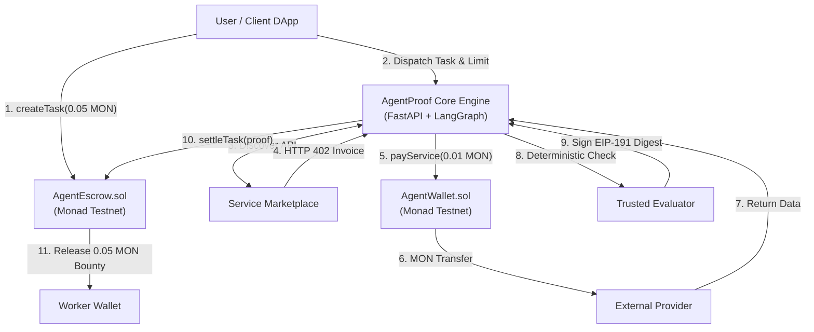
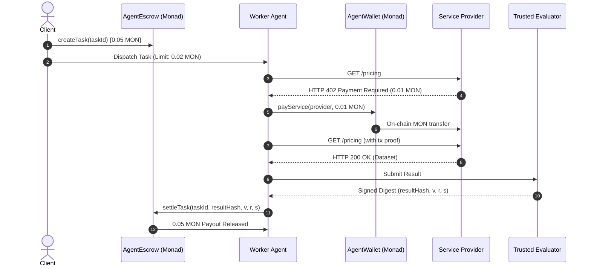

<div align="center">

# ⚡ AgentProof
### The On-Chain Economic & Settlement Layer for Autonomous AI Agents

[-8A2BE2?style=for-the-badge&logo=ethereum&logoColor=white)](https://testnet.monadscan.com)
[](https://soliditylang.org/)
[](https://fastapi.tiangolo.com)
[](https://github.com/langchain-ai/langgraph)
[](https://nextjs.org/)
[-brightgreen?style=for-the-badge&logo=pytest&logoColor=white)](./run_tests.py)
[](https://monad.xyz)

<br/>

> **"Spend by policy. Work autonomously. Get paid by proof."**

<br/>

**[🌐 Live Deployment](https://agentproof.vercel.app)** • **[💻 GitHub Repository](https://github.com/Aaryan-Sharma-5/AgentProof)** • **[🔍 MonadScan Explorer](https://testnet.monadscan.com)**

</div>

---

## 1. 📌 Executive Summary

**AgentProof** is a decentralized, on-chain economic operating and settlement protocol built for autonomous AI agents on **Monad**. 

Today, AI agents lack native economic autonomy. Giving an agent an unconstrained private key risks catastrophic treasury drain, while requiring manual human approval destroys autonomy. AgentProof solves both sides of the loop through two decoupled financial primitives:
1. **AgentFlow (`AgentWallet.sol`)**: Restricts what an agent can **spend** via deterministic spending policies and immutable per-transaction caps.
2. **ProofBounty (`AgentEscrow.sol`)**: Governs when an agent gets **paid** by releasing escrowed funds only upon cryptographic verification of completed work.

```text
       ┌────────────────────────────────────────────────────────┐
       │                       USER / CLIENT                     │
       │       Dispatches Task + Locks Reward + Sets Budget     │
       └───────────────────────────┬────────────────────────────┘
                                   │
                                   ▼
       ┌────────────────────────────────────────────────────────┐
       │                     AUTONOMOUS AGENT                   │
       │                                                        │
       │   [SPENDING PRIMITIVE]              [EARNING PRIMITIVE]│
       │       AgentFlow                         ProofBounty    │
       │           │                                  │         │
       │    AgentWallet.sol                    AgentEscrow.sol  │
       │   "Can I spend this?"               "Did I earn this?" │
       │           │                                  │         │
       │   HTTP 402 Paywall                  Verified Settlement│
       │    Buys API Data                      Collects Reward  │
       └───────────────────────────┬────────────────────────────┘
                                   │
                                   ▼
       ┌────────────────────────────────────────────────────────┐
       │            COMPLETED & CRYPTOGRAPHICALLY PROVEN        │
       │          Sub-Second Finality on Monad Testnet          │
       └────────────────────────────────────────────────────────┘
```

---

## 2. 🌍 The Real-World Problem

1. **The Autonomous Spending Paradox**: If an AI agent holds an unconstrained private key, hallucinations, prompt injections, or logic loops can drain the entire wallet. If a human must approve every micro-transaction, autonomous execution is broken.
2. **The Missing Machine Payment Rail (HTTP 402)**: Agents need to acquire real-time external data (APIs, market feeds, compute). Traditional fiat rails require credit cards, human KYC, and high fees, keeping the `HTTP 402 Payment Required` standard unusable.
3. **The Earning Counterparty Dilemma**: Upfront payments expose clients to incomplete or hallucinated deliverables. Post-work payments expose worker agents to non-paying clients. Subjective human arbitration cannot scale to machine-speed workflows.

---

## 3. 💡 The Solution

AgentProof establishes an end-to-end, two-sided economic framework:

- **Controlled Expenditure (`AgentWallet.sol`)**: An immutable, non-custodial smart contract wallet with an immutable per-transaction ceiling (`0.02 MON`). Even if an LLM is compromised, it is mathematically incapable of spending above policy.
- **Conditional Bounty Settlement (`AgentEscrow.sol`)**: Client bounties are locked in escrow upfront and programmatically released to the worker via deterministic cryptographic authorization (EIP-191 ECDSA `ecrecover`).
- **Dynamic Service Marketplace (HTTP 402)**: External developers list APIs priced in MON. Agents query endpoints, receive instant HTTP 402 payment invoices, settle on Monad, and receive data autonomously.
- **Sub-Second Finality via Monad**: Leveraging Monad’s 10,000 TPS and 1-second block finality, agents execute streaming micro-payments with negligible gas overhead.

---

## 4. 🏆 Live Deployment, Contracts & Team

### 4.1 🌐 Official Links & Live Application

| Resource | Link | Description |
|---|---|---|
| **Live Web3 Application** | **[https://agentproof.vercel.app](https://agentproof.vercel.app)** | Production Next.js 14 dApp on Monad Testnet |
| **GitHub Repository** | **[https://github.com/Aaryan-Sharma-5/AgentProof](https://github.com/Aaryan-Sharma-5/AgentProof)** | Open-source codebase, contracts, & test suites |
| **Monad Testnet Explorer** | **[https://testnet.monadscan.com](https://testnet.monadscan.com)** | Monad Testnet Block Explorer (Chain ID: `10143`) |

---

### 4.2 📜 Verified Smart Contracts (Monad Testnet — Chain ID: 10143)

| Contract | Address | Verification Status | Explorer Link |
|---|---|:---:|---|
| **`AgentWallet.sol`** | `0x7263058B4040ae7410340f63d292152DE8d867FA` | **Verified ✅** | [View on MonadScan](https://testnet.monadscan.com/address/0x7263058B4040ae7410340f63d292152DE8d867FA#code) |
| **`AgentEscrow.sol`** | `0x0AEb04B6e92984EC94BbbB4aF234efD080e8e9f1` | **Verified ✅** | [View on MonadScan](https://testnet.monadscan.com/address/0x0AEb04B6e92984EC94BbbB4aF234efD080e8e9f1#code) |

#### Deployment Parameters
- **Trusted Verifier Authority (`VERIFIER_KEY`)**: `0x4c7c4d8155Fed9b9f09c6619d98773ACcA881305`
- **Authorized Agent Identity (`agent`)**: `0x4c7c4d8155Fed9b9f09c6619d98773ACcA881305`
- **Immutable Per-Payment Cap**: `0.02 MON`

#### Contract Deployment Transactions
- **`AgentWallet` Deployment Tx**: [`0x0865338519b8dd04a90b8899cf32edbb7f93c692bd95fbb527f6375d67479d68`](https://testnet.monadscan.com/tx/0x0865338519b8dd04a90b8899cf32edbb7f93c692bd95fbb527f6375d67479d68) *(Block: `63835810`)*
- **`AgentEscrow` Deployment Tx**: [`0x59205ac7390d8729a120e814db982afea026640ba7476e9752ae8293160fd0ef`](https://testnet.monadscan.com/tx/0x59205ac7390d8729a120e814db982afea026640ba7476e9752ae8293160fd0ef) *(Block: `63835813`)*

---

### 4.3 ⚡ Canonical Verified End-to-End Live Transactions

The complete economic loop was executed on Monad Testnet and confirmed on-chain:

| Lifecycle Step | Transaction Hash | Value | Description |
|---|---|---|---|
| **1. Lock Reward** | [`0x28524c577fdb26ae291e56da7e3ef7a4d1f981572aa240b18a7763350b7f240c`](https://testnet.monadscan.com/tx/0x28524c577fdb26ae291e56da7e3ef7a4d1f981572aa240b18a7763350b7f240c) | `0.05 MON` | Client locks bounty in `AgentEscrow` |
| **2. Pay Provider** | [`0x37772639ffcc4144d35757634bd26a9a5348ab38eeb3d9212e7186813368ef38`](https://testnet.monadscan.com/tx/0x37772639ffcc4144d35757634bd26a9a5348ab38eeb3d9212e7186813368ef38) | `0.01 MON` | `AgentWallet` pays HTTP 402 invoice |
| **3. Settle Bounty** | [`0xefc36e3357895f59c4a9ec18fae1139ad38550d3048001a3fffce18e5e80e0a8`](https://testnet.monadscan.com/tx/0xefc36e3357895f59c4a9ec18fae1139ad38550d3048001a3fffce18e5e80e0a8) | `0.05 MON` | `AgentEscrow` releases bounty to worker |
| **Canonical Task ID** | `0x8f01fd3dd74d67bd88241970c7123e1b701a5a78b2a6269eb7a564b4dd5b925c` | — | Canonical Competitor Pricing task |

---

### 4.4 👥 Team Members & Engineering Ownership

<div align="center">

| Name | Role | Core Ownership & Contributions |
|---|---|---|
| **HARMAN SAINI** | **System Architect & Backend / AI Lead** | • Multi-Agent Orchestration (LangGraph workflow & state routing)<br/>• FastAPI Enterprise Core Engine & Gateway protocol abstractions<br/>• Deterministic Policy Engine, Risk Scoring, & Supervisor coordination<br/>• Security Boundaries: SSRF defenses, idempotency deduplication |
| **AARYAN SHARMA** | **Full-Stack & Frontend Lead** | • Next.js 14 Web3 Application Architecture (App Router & Tailwind UI)<br/>• Monad Testnet Wallet Integration (Wagmi v2, Viem, React Query)<br/>• Decentralized Service Marketplace Directory & Provider Registration<br/>• Real-Time Agent Telemetry, Task Dashboard, & Tx Monitoring |
| **RAGHAVENDRA SINGH** | **Smart Contract & Blockchain Infra Lead** | • Solidity Smart Contract Engineering (`AgentWallet` & `AgentEscrow`)<br/>• Cryptographic EIP-191 ECDSA Settlement & Anti-Replay logic<br/>• Foundry Test Suites, Gas Optimization, & Monad Testnet Deployment<br/>• Contract Verification on MonadScan & On-Chain Event Ingestion |

</div>

---

## 5. 🏛️ Architecture & Smart Contract Interfaces

```
┌──────────────────────────────────────────────────────────────────────────┐
│                         FRONTEND (NEXT.JS 14)                            │
│     [Task Creation UI]  •  [Service Marketplace]  •  [Agent Monitor]     │
└────────────────────────────────────┬─────────────────────────────────────┘
                                     │ Viem / Wagmi
                                     ▼
┌──────────────────────────────────────────────────┐  ┌────────────────────┐
│          FASTAPI + LANGGRAPH MULTI-AGENT         │  │   MONAD TESTNET    │
│  Requirement Agent ──► Discovery Agent           │  │                    │
│          │                      │                │  │  AgentWallet.sol   │
│          ▼                      ▼                │  │  - Hard Max Cap    │
│    Policy Engine   ──►     Risk Engine           │  │  - payService()    │
│          │                      │                │  └─────────▲──────────┘
│          ▼                      ▼                │            │
│  Payment Orchestrator ───────────────────────────┼────────────┘
│          │                                       │
│          ▼                                       │  ┌────────────────────┐
│     API Executor (Strict SSRF Defenses)          │  │  AgentEscrow.sol   │
│          │                                       │  │  - createTask()    │
│          ▼                                       │  │  - settleTask()    │
│  Verification Agent ──► Supervisor / Evaluator ──┼──┤    (ECDSA ecrecover│
└──────────────────────────────────────────────────┘  └─────────▲──────────┘
                                                                │
                                              settleTask(proof) ┘
```

### Core Smart Contract Interfaces

```solidity
// Controlled Outflow: AgentWallet.sol
interface IAgentWallet {
    event PaymentSettled(address indexed provider, uint256 amount);
    function deposit() external payable;
    function payService(address payable provider, uint256 amount) external;
    function agent() external view returns (address);
    function maxPayment() external view returns (uint256);
}

// Conditional Inflow: AgentEscrow.sol
interface IAgentEscrow {
    event TaskCreated(bytes32 indexed taskId, address indexed creator, uint256 reward);
    event TaskSettled(bytes32 indexed taskId, address indexed worker, uint256 reward, bytes32 resultHash);
    function createTask(bytes32 taskId) external payable;
    function settleTask(bytes32 taskId, bytes32 resultHash, uint8 v, bytes32 r, bytes32 s) external;
    function trustedVerifier() external view returns (address);
}
```

---

## 6. 🔄 Workflow & Cryptographic Settlement

### 6.1 The Canonical Execution Loop
1. **Task Creation**: Client deposits `0.05 MON` into `AgentEscrow.createTask(taskId)`.
2. **Task Dispatch**: Worker Agent initializes LangGraph workflow with spending budget `0.02 MON`.
3. **HTTP 402 Challenge**: Worker queries Marketplace API; Provider responds with `HTTP 402` (`0.01 MON` invoice).
4. **Policy Check**: Policy Engine confirms `0.01 MON <= 0.02 MON` cap $\rightarrow$ **APPROVED**.
5. **Micropayment**: Worker calls `AgentWallet.payService(provider, 0.01 MON)` on Monad Testnet.
6. **Data Delivery**: Provider verifies `PaymentSettled` event on-chain and returns proprietary data.
7. **Verification & Proof**: Evaluator checks schema and signs canonical digest:
   $$\text{raw} = \text{keccak256}(\text{abi.encode}(\text{block.chainid}, \text{address}(this), \text{taskId}, \text{msg.sender}, \text{resultHash}))$$
   $$\text{digest} = \text{keccak256}(\text{abi.encodePacked}(\text{"\x19Ethereum Signed Message:\n32"}, \text{raw}))$$
8. **Settlement**: Worker calls `AgentEscrow.settleTask(...)`. Contract verifies `ecrecover(digest, v, r, s) == trustedVerifier` and releases `0.05 MON` reward to worker.

### 6.2 Deterministic Safeguards
- **Overspending Rejection**: If invoice exceeds budget (`0.03 MON > 0.02 MON`), Policy Engine halts execution; wallet is never called; 0 MON spent.
- **Tampered Proof Reversion**: If worker alters result hash, recovered signer $\neq$ `trustedVerifier`; `settleTask` transaction reverts; funds remain safe in escrow.
- **Anti-Replay**: The signed digest binds `block.chainid`, contract address, and `msg.sender` (worker address), preventing cross-chain or frontrunning replay.

---

## 7. 🗺️ Implementation Tasks & Built Features

- [x] **Smart Contracts**: Built, optimized, and deployed `AgentWallet` and `AgentEscrow` on Monad Testnet.
- [x] **Multi-Agent Engine**: Implemented Requirement, Discovery, Policy, Risk, Verification, and Supervisor nodes in LangGraph.
- [x] **Security Hardening**: Built RFC 1918 / link-local SSRF guards and request-level idempotency deduplication.
- [x] **Service Marketplace**: Native HTTP 402 machine invoice generator and automated Monad tx confirmation.
- [x] **Web3 Frontend**: High-performance Next.js 14 dApp featuring task creation, marketplace directory, and live agent monitoring.
- [x] **Verification**: **67/67 automated tests passing** across unit, graph, security, edge-case, and integration suites.

---

## 8. 🛠️ Technology Stack

| Layer | Technologies |
|---|---|
| **Blockchain** | Monad Testnet (Chain ID 10143), Solidity 0.8.20, Foundry (`forge`, `cast`), Viem, Web3.py |
| **AI Orchestration** | LangGraph, LangChain Core, Pydantic v2, Python 3.11+, TypeScript, Node.js v20+ |
| **Backend & API** | FastAPI, Uvicorn (ASGI), SSRF Network Guard, In-Memory Repository & Idempotency Store |
| **Frontend dApp** | Next.js 14 (App Router), Wagmi v2, TanStack React Query, Tailwind CSS |
| **Testing** | 67 Automated Suites (Pytest & Custom Runner), Foundry Fuzzing Tests |

---

## 9. 📊 Architecture Diagrams

### 9.1 System Topology



### 9.2 Cryptographic Settlement Sequence



---

## 10. 📝 Note: How to Use the Platform

> [!IMPORTANT]
> **Monad Testnet Configuration**:
> - **RPC URL**: `https://testnet-rpc.monad.xyz` | **Chain ID**: `10143` | **Currency**: `MON` | **Explorer**: `https://testnet.monadscan.com`

Follow these exact steps to run the protocol locally or interact with the live deployment:

### 1. Environment Setup
```bash
git clone https://github.com/Aaryan-Sharma-5/AgentProof.git
cd AgentProof
```
Configure `.env` in the root:
```env
MONAD_RPC=https://testnet-rpc.monad.xyz
CHAIN_ID=10143
AGENT_WALLET_ADDRESS=0x7263058B4040ae7410340f63d292152DE8d867FA
ESCROW_ADDRESS=0x0AEb04B6e92984EC94BbbB4aF234efD080e8e9f1
VERIFIER_KEY=0x4c7c4d8155Fed9b9f09c6619d98773ACcA881305
PROVIDER_URL=http://localhost:3001
```

### 2. Run the 67 Automated Test Suites
```bash
pip install -r requirements.txt
python run_tests.py
```
*Expected Result: `RESULTS: Total: 67 | Passed: 67 | Failed: 0 | Skipped: 0`*

### 3. Launch HTTP 402 Data Provider
```bash
cd agents
npm install
npm run provider
```
*Exposes `GET http://localhost:3001/pricing` returning HTTP 402 until paid.*

### 4. Run the Autonomous Worker Agent
```bash
# In a separate terminal
cd agents
npm run worker
```
*Executes the complete autonomous loop: discovers API $\rightarrow$ pays via `AgentWallet` $\rightarrow$ parses data $\rightarrow$ gets proof $\rightarrow$ settles `AgentEscrow`.*

### 5. Launch the Web3 DApp Dashboard
```bash
cd frontend
npm install
npm run dev
```
Open **[http://localhost:3000](http://localhost:3000)** to:
- Connect MetaMask or your Web3 wallet on Monad Testnet.
- **Create Task (`/create-task`)**: Deposit MON into escrow and define agent spending bounds.
- **Marketplace (`/marketplace`)**: Browse and register HTTP 402 services.
- **Monitor (`/dashboard`)**: Observe real-time multi-agent execution telemetry and on-chain tx receipts.

---

### 10.1 🏁 Monad Blitz Hackathon Checklist & Socials

- [x] **Public GitHub**: [github.com/Aaryan-Sharma-5/AgentProof](https://github.com/Aaryan-Sharma-5/AgentProof)
- [x] **Verified Contracts**: Live on Monad Testnet ([AgentWallet](https://testnet.monadscan.com/address/0x7263058B4040ae7410340f63d292152DE8d867FA#code) & [AgentEscrow](https://testnet.monadscan.com/address/0x0AEb04B6e92984EC94BbbB4aF234efD080e8e9f1#code))
- [x] **Hosted Web3 App**: [agentproof.vercel.app](https://agentproof.vercel.app)
- [x] **Autonomous Settlement**: Verified live transactions on MonadScan
- [x] **Build In Public**: Tagging [@monad](https://twitter.com/monad), [@monad_dev](https://twitter.com/monad_dev), [@geeky_kartikey](https://twitter.com/geeky_kartikey)

---

<div align="center">

**AgentProof — Built with ⚡ for Monad Blitz Mumbai V4**

*Spend by policy. Work autonomously. Get paid by proof.*

</div>
